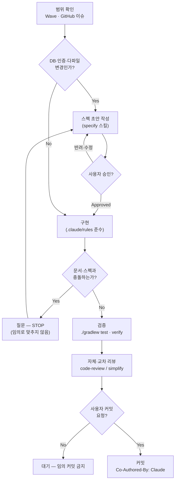

# TripFit-server

여행 일정 조율 서비스 **TripFit**의 백엔드 API 서버.

이 저장소는 코드뿐 아니라, **AI 코딩 에이전트의 실행 환경을 설계·통제(Harnessing)** 하는 방식을 함께 담고 있습니다. 기획·스펙·아키텍처 결정을 문서로 고정하고, AI가 그 계약 안에서만 구현하도록 규칙·스킬·훅으로 실행 경로를 제한합니다.

## AI Harness — 어디부터 볼까

AI 에이전트(그리고 신규 합류자)가 **추측하지 않고** 일관되게 작업하도록, 다층 컨텍스트를 저장소에 박아 두었습니다.

| 진입점 | 역할 |
|--------|------|
| [`AGENTS.md`](AGENTS.md) | **프로젝트 지도** — 무엇을 어디서 찾는지, 기술 스택, 금기사항 |
| [`.claude/rules/README.md`](.claude/rules/README.md) | **에이전트 행동 규칙** — rules(`.md`) · skills · hooks 구조 |
| [`.claude/rules/harness-workflow.md`](.claude/rules/harness-workflow.md) | **최우선 STOP** — 문서·스펙 정합 · ErrorCode/AOP · DB · 레거시 |
| [`.claude/rules/harness-wave.md`](.claude/rules/harness-wave.md) | Wave Must/Nice/Out · `[미정]`→#2 · 일정·기간 용어 |
| [`.claude/rules/harness-follow-up.md`](.claude/rules/harness-follow-up.md) | 후속 제안 · Defer · ERD 적극 제안 |
| [`.claude/skills/specify/SKILL.md`](.claude/skills/specify/SKILL.md) | **승인 게이트** — 큰 변경은 스펙 작성 → 승인 후 구현 |
| [`docs/README.md`](docs/README.md) | **문서 SSOT** — 기획·아키텍처·스펙 인덱스 |

### 실행 경로를 제한하는 3가지 장치

- **다층 SSOT** — 기획(`docs/product/`) → 기능 스펙(`docs/specs/`) → 아키텍처 결정(`docs/decisions/`) → 규칙(`.claude/rules/`). 값·계약이 문서와 다르면 조용히 맞추지 않고 질문한다.
- **승인 게이트** — DB·인증·다파일 변경은 `specify` 스킬로 Approved 스펙을 만든 뒤에만 코드를 작성한다. 예: [`docs/specs/trip-room-api.md`](docs/specs/trip-room-api.md) (BR·wave·미정 항목까지 명시).
- **안전 하한선** — `PreToolUse` 훅([`.claude/settings.json`](.claude/settings.json))이 `git push --force`·`rm -rf` 등 파괴적 명령을 **fail-closed**로 차단한다.

**워크플로:** `wave 확인 → (Plan Mode) → specify/Approved → 구현 → ./gradlew test → verify → PR`

## AI 개발 워크플로 — 단계별 활용

이 저장소는 기획 확인부터 커밋까지, 각 단계에서 AI 코딩 에이전트(Claude Code)가 실행 주체를 맡고 사람은 **승인·리뷰 게이트**로 개입하는 방식으로 개발됩니다. 코드 자체뿐 아니라 스펙·ADR·규칙 문서도 대부분 AI가 초안을 작성하고 사람이 확정합니다.



| 단계 | AI의 역할 | 산출물·도구 |
|------|-----------|-------------|
| **범위 확인** | 활성 Wave·GitHub 이슈로 작업 범위를 먼저 확인 — Backlog 없이 Must/Nice를 임의 단정하지 않음 | `docs/product/development-wave.md`, `.claude/rules/harness-wave.md` |
| **설계·스펙 작성** | 요구사항을 정리해 `specify` 스킬로 스펙 문서를 초안 작성 — DB·인증·다파일 변경은 **스펙 승인 전 구현 착수 금지** | `docs/specs/*.md` (Draft → Approved) |
| **아키텍처 결정** | 구조적 트레이드오프·대안을 ADR로 기록 | `docs/decisions/00N-*.md` |
| **구현** | Approved 스펙의 계약(API·에러코드·enum·DB) 안에서만 코드 작성. 레이어·네이밍·주석 규칙은 `.claude/rules/`가 강제 | `src/main/java/com/tripfit/tripfit/...` |
| **검증** | 단위·통합 테스트 작성 및 회귀 확인, 필요 시 실제 구동으로 동작 확인 | `./gradlew test`, `verify` 스킬 |
| **자체·교차 리뷰** | 정확성·중복·단순화 관점의 자체 리뷰, 필요 시 다중 에이전트 클라우드 리뷰 | `code-review`/`simplify` 스킬, `/code-review ultra` |
| **문서 동기화** | 구현이 문서와 어긋나면 임의로 맞추지 않고 **질문** — 문서·스펙·결정 간 충돌은 사람에게 확인 | `.claude/rules/harness-workflow.md` STOP 절 |
| **커밋·이력** | 사람이 명시적으로 요청할 때만 커밋, 주제별로 분할 | `Co-Authored-By: Claude` 커밋 트레일러 |
| **안전장치** | `git push --force`·`rm -rf` 등 파괴적 명령을 실행 전 차단 | `PreToolUse` 훅([`.claude/hooks/block-dangerous.sh`](.claude/hooks/block-dangerous.sh)) |

이 저장소의 커밋 이력 상당수가 이 워크플로로 생성되었습니다(`git log --grep "Co-Authored-By: Claude"`로 확인 가능). 스펙·ADR 전체 목록은 [`docs/specs/README.md`](docs/specs/README.md)·[`docs/decisions/README.md`](docs/decisions/README.md) 참고.

## Tech Stack

- Java 21 · Spring Boot 4.1.0 · Gradle (wrapper 포함)
- MySQL 8.0 (런타임) / H2 (test) · JUnit 5
- Docker + GHCR (배포) · EC2 Nginx + Spring Boot

## 문서 지도

| 경로 | 용도 |
|------|------|
| [`docs/product/development-wave.md`](docs/product/development-wave.md) | **Wave 운영·판단·Backlog** SSOT |
| [`docs/product/waves.md`](docs/product/waves.md) | Wave 1~4 요약표 |
| [`docs/product/`](docs/product) | PRD · MVP · 비즈니스 룰(BR-*) · 용어 · 플로우 |
| [`docs/specs/`](docs/specs) | 기능 스펙 (구현 전 Approved) |
| [`docs/architecture.md`](docs/architecture.md) | 레이어·패키지·설정·DB 요약 |
| [`docs/decisions/`](docs/decisions) | 인프라·아키텍처 확정 (ADR) |
| [`deploy/README.md`](deploy/README.md) | Docker·EC2 배포 SSOT |
| [`.github/CONTRIBUTING.md`](.github/CONTRIBUTING.md) | 브랜치·커밋·PR 규약 |

## 로컬 실행

```bash
cp .env.example .env      # 최초 1회 — Auth env 등 채우기
docker compose up -d      # MySQL만 (로컬 DB)
./gradlew bootRun         # Spring 로컬 실행 (local 프로필, .env 자동 로드)
./gradlew test            # 테스트
./gradlew build           # 빌드
```

배포·검증 스크립트는 [`deploy/README.md`](deploy/README.md) 참고.

## Conventions

- 패키지: `com.tripfit.tripfit` — 도메인 기반 레이어드 (`{domain}/controller|dto|service|domain|repository|client`, 공통 `common/`)
- 커밋: `{Type}: {한글 설명}` (Type 첫 글자 대문자) — 상세 [`.github/CONTRIBUTING.md`](.github/CONTRIBUTING.md)
- 범위 밖 리팩터링·포맷 변경 금지, 비밀값(`.env`·API 키)은 커밋 금지
