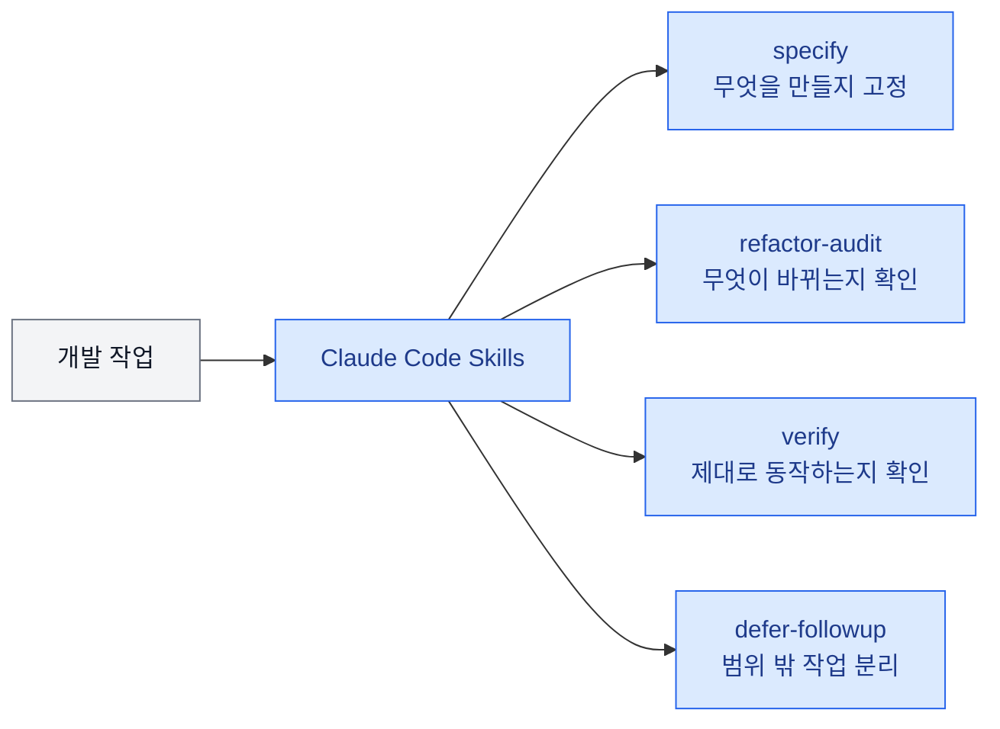
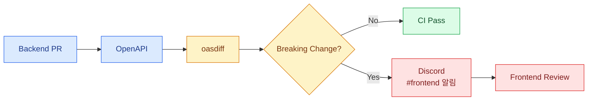

# TripFit-server

[](https://github.com/Central-MakeUs/TripFit-server/actions/workflows/ci-cd.yml)


## 프로젝트 소개

**TripFit**은 여행 일정 조율 서비스의 백엔드 API 서버입니다. 그룹 여행에서 각자의 일정을 모아 최적의 날짜 후보를 산출하고, 방장이 일정을 확정합니다.

이 프로젝트의 핵심은 **AI를 실제 백엔드 개발에 적용하면서 품질을 자동 검증하는 환경**을 만든 것입니다.

**사람이 결정하고, AI가 구현하고, 자동으로 검증한 뒤 사람이 최종 확인합니다.**

설계 배경: [`docs/harness-engineering.md`](docs/harness-engineering.md)

| 항목 | 링크 |
|------|------|
| API 서버 | https://api.tripfit.online |
| Swagger UI | https://api.tripfit.online/swagger-ui.html |
| OpenAPI 스냅샷 | [`docs/api/openapi.json`](docs/api/openapi.json) |
| 모니터링 (Grafana + Loki) | https://grafana.tripfit.online |
| 프론트엔드 | https://tripfit.online |

## 핵심 기능

- **가중치 기반 추천 엔진** — 개인 근무일정·연차 조건을 반영한 페널티 스코어링으로 4가지 모드별 TOP 3 날짜 후보 산출
- **그룹 일정 조율** — 참여자별 오전/오후/저녁 일정 입력 및 그룹 달력 시각화
- **소셜 로그인 3종** — 카카오·구글·애플 로그인과 provider별 토큰 검증·탈퇴 revoke 정책 통일
- **여행방 홈** — 진행 중/전체 2-뷰와 Pin·최근 활동(`last_activity_at`) 기준 정렬
- **알림** — FCM 기반 일정 리마인더 배치 스케줄러

## 기술 스택

Java 21 · Spring Boot 4.1 · Gradle · MySQL 8.0 · JUnit 5 · Docker + GHCR · EC2 Nginx

- **MySQL 8 + Testcontainers** — 로컬 목킹 대신 실제 DB 엔진으로 테스트해 dev(EC2)와 DB 동작 차이를 줄임
- **API·프론트 배포 분리** — `api.tripfit.online` EC2 / `tripfit.online` Vercel. 두 시스템의 유일한 접점인 API contract를 자동 검증

## 아키텍처

- **도메인 기반 레이어드** — `auth · user · trip · notification · common`, 도메인 내부는 `controller → dto → service → domain → repository` 구조. 도메인 안 기능이 커지면 `{domain}/{feature}/`에 같은 레이어를 반복 (`user/schedule`, `trip/membership`, `trip/recommendation`, `trip/schedule` 등)
- **포트/어댑터로 도메인 간 참조 역전** — `trip`이 `user`(개인 일정·Google Calendar 연동·유저 조회)를 참조할 때는 `trip/port/out/`에 정의한 인터페이스로만 접근하고, 실제 구현(어댑터)은 `user` 도메인이 가진다. 풀 DDD 애그리거트 없이 크로스 도메인 의존 방향만 역전한 절충안 — ADR: [`decisions/003`](docs/decisions/003-architecture-guide.md)
- **Architecture enforcement** — 레이어·의존 방향 규칙을 [`ArchitectureTest.java`](src/test/java/com/tripfit/tripfit/architecture/ArchitectureTest.java)(ArchUnit)가 `./gradlew test`마다 검증
- **DB** — PK/FK UUID v4, snake_case, Soft Delete. ERD: [`docs/architecture/erd.md`](docs/architecture/erd.md)
- **배포** — GitHub Actions → GHCR → EC2 Nginx + Spring Boot. ADR: [`decisions/002`](docs/decisions/002-domain-split-vercel-api.md)

## AI Engineering

TripFit의 AI 개발 방식은 간단합니다.

**사람이 결정 → AI가 구현 → 자동으로 검증 → 사람이 최종 확인**

AI를 많이 사용하는 것보다, **AI가 만든 결과를 안전하게 확인할 수 있는 구조**를 만드는 데 집중했습니다.

### 1. 전체 개발 흐름


```mermaid
flowchart LR
    A["사람<br/>요구사항 결정"]
    B["AI Agent<br/>설계·구현"]
    C["자동 검증<br/>Test · Architecture · API"]
    D["사람<br/>Review · Merge"]

    A --> B --> C --> D
    C -. "실패" .-> B

    classDef human fill:#EDE9FE,stroke:#8B5CF6,color:#4C1D95
    classDef ai fill:#DBEAFE,stroke:#2563EB,color:#1E3A8A
    classDef machine fill:#FEF3C7,stroke:#D97706,color:#78350F

    class A,D human
    class B ai
    class C machine
```

사람은 요구사항과 중요한 변경을 결정합니다. AI는 구현을 담당하고, 자동 검증이 통과된 결과만 사람이 최종 확인합니다.

### 2. Human · AI · Machine 역할

| 단계 | Human | AI Agent | Machine |
|---|---:|---:|---:|
| 요구사항·설계 의도 | ✓ | 보조 | |
| 구현 계획·코드 작성 | | ✓ | |
| 테스트 작성 | | ✓ | |
| 테스트 실행 | | | ✓ |
| Architecture 검증 | | | ✓ |
| API Contract 검증 | | | ✓ |
| 변경 범위 검증 | | | ✓ |
| 중요한 변경 승인 | ✓ | | |

### 3. 직접 만든 Claude Code Skills

AI가 매번 임의의 방식으로 작업하지 않도록 repository 안에 작업별 Skill을 만들었습니다.


```mermaid
flowchart LR
    T["개발 작업"] --> S["Claude Code Skills"]

    S --> A["specify<br/>무엇을 만들지 고정"]
    S --> B["refactor-audit<br/>무엇이 바뀌는지 확인"]
    S --> C["verify<br/>제대로 동작하는지 확인"]
    S --> D["defer-followup<br/>범위 밖 작업 분리"]

    classDef task fill:#F3F4F6,stroke:#6B7280,color:#111827
    classDef skill fill:#DBEAFE,stroke:#2563EB,color:#1E3A8A

    class T task
    class S,A,B,C,D skill
```

대표 Skill: [`specify`](.claude/skills/specify/SKILL.md) · [`refactor-audit`](.claude/skills/refactor-audit/SKILL.md) · [`verify`](.claude/skills/verify/SKILL.md) · [`defer-followup`](.claude/skills/defer-followup/SKILL.md)

Skill은 프롬프트 모음이 아닙니다. **작업 범위와 검증 절차를 repository에 규칙으로 남긴 것**입니다.

### 4. API Contract + Discord 안전장치

프론트엔드와 백엔드가 별도 배포되기 때문에 API 변경을 Claude Code에만 맡기지 않습니다.

GitHub Actions에서 oasdiff로 API contract를 독립적으로 비교하고, breaking change가 발견되면 Discord #frontend에 알립니다.


```mermaid
flowchart LR
    A["Backend PR"]
    B["OpenAPI"]
    C["oasdiff"]
    D{"Breaking Change?"}
    E["CI Pass"]
    F["Discord<br/>#frontend 알림"]
    G["Frontend Review"]

    A --> B --> C --> D
    D -->|No| E
    D -->|Yes| F --> G

    classDef source fill:#DBEAFE,stroke:#2563EB,color:#1E3A8A
    classDef check fill:#FEF3C7,stroke:#D97706,color:#78350F
    classDef success fill:#DCFCE7,stroke:#16A34A,color:#14532D
    classDef alert fill:#FEE2E2,stroke:#DC2626,color:#7F1D1D

    class A,B source
    class C,D check
    class E success
    class F,G alert
```

이 검증은 **Claude Code와 별개로 CI에서 항상 실행**됩니다.

실제 incident를 통해 검증 범위도 확장했습니다.

- [`#64`](https://github.com/Central-MakeUs/TripFit-server/issues/64) — API contract drift 이후 2차 감지 추가
- [`#75`](https://github.com/Central-MakeUs/TripFit-server/issues/75) — 교차검증 필요성을 발견해 3차 검증 추가
- [`509a328`](https://github.com/Central-MakeUs/TripFit-server/commit/509a328) — 관련 수정

### 5. 검증 체크포인트

| 체크포인트 | 담당 | 무엇을 확인하는가 | 실패 시 |
|---|---|---|---|
| `specify` | Human | 스펙과 범위 | 구현 중단 |
| `refactor-audit` | Machine | API diff | 구현 되돌림 |
| `verify` | Machine | 실제 테스트·contract 결과 | 완료 처리 불가 |
| `defer-followup` | Human | 범위 밖 작업 | 후속 이슈로 분리 |
| API contract CI | External Machine | OpenAPI breaking change | Discord 알림 |

### 6. Harness가 진화한 방식

하네스는 처음부터 완성된 규칙이 아니었습니다. 실제 실패가 발생할 때마다 검증 장치를 추가했습니다.

```text
Incident
  ↓
실패 원인 확인
  ↓
검증 공백 발견
  ↓
자동 검증 추가
  ↓
재발 방지
```

결국 이 프로젝트의 AI Engineering은 **AI가 더 많은 일을 맡아도 품질을 확인할 수 있는 개발 시스템을 만드는 것**입니다.

## 프로젝트 구조

```text
com.tripfit.tripfit
├── auth/           # 소셜 로그인 3종·JWT·OAuth
├── user/           # 프로필·온보딩·개인 일정 (schedule 서브패키지)
├── trip/           # 여행방 (membership/recommendation/schedule 서브패키지, port/out으로 user 참조)
├── notification/   # FCM·배치 스케줄러
└── common/         # 응답 envelope·예외·베이스 엔티티
```

도메인 내부는 `controller → dto → service → domain → repository` 구조입니다. 전체 레이아웃: [`docs/architecture.md`](docs/architecture.md)

## 실행 방법

```bash
cp .env.example .env      # 최초 1회 — Auth env 등 채우기
docker compose up -d      # MySQL만 (로컬 DB)
./gradlew bootRun         # Spring 로컬 실행 (local 프로필, .env 자동 로드)
./gradlew test            # 테스트
```

배포·검증 스크립트: [`deploy/README.md`](deploy/README.md)

## 문서

| 경로 | 용도 |
|------|------|
| [`docs/harness-engineering.md`](docs/harness-engineering.md) | 하네스 엔지니어링 설계 배경·전체 인시던트 이력 |
| [`docs/product/development-wave.md`](docs/product/development-wave.md) | Wave 운영·판단·Backlog SSOT |
| [`docs/specs/`](docs/specs) | 기능 스펙 (구현 전 Approved) |
| [`docs/decisions/`](docs/decisions) | 인프라·아키텍처 확정 (ADR) |
| [`docs/architecture.md`](docs/architecture.md) | 레이어·패키지·설정·DB 요약 |
| [`deploy/README.md`](deploy/README.md) | Docker·EC2 배포 SSOT |
| [`.github/CONTRIBUTING.md`](.github/CONTRIBUTING.md) | 브랜치·커밋·PR 규약 |
