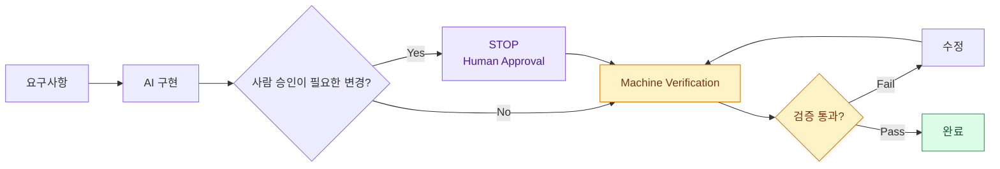
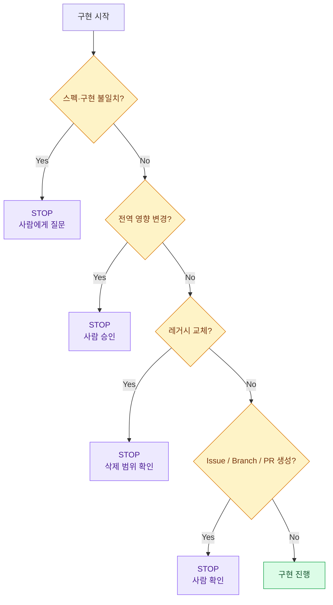
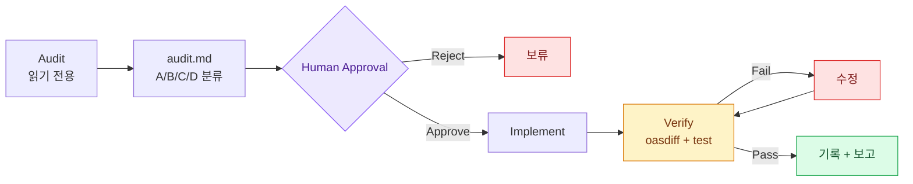
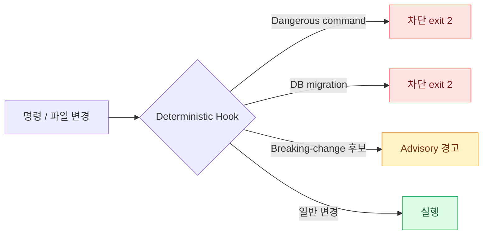
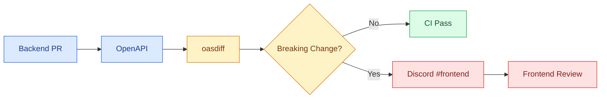
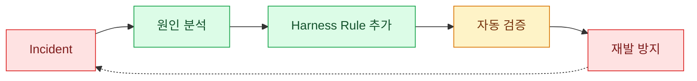

# TripFit-server

[](https://github.com/Central-MakeUs/TripFit-server/actions/workflows/ci-cd.yml)


## 프로젝트 소개

**TripFit**은 그룹 여행에서 참여자들의 일정을 조율하고 최적의 여행 날짜를 추천하는 백엔드 API 서버입니다.

여행방, 일정 조율, 추천, 소셜 로그인, Google Calendar 연동, 알림 등의 기능을 Spring Boot 기반으로 구현했습니다.

이 프로젝트의 핵심은 **AI를 많이 사용하는 것 자체가 아니라, AI가 실제 백엔드 코드를 작성하는 환경에서도 품질을 검증할 수 있는 개발 시스템을 구축한 것**입니다.

> **사람이 결정하고 → AI가 구현하고 → Machine이 검증하고 → 사람이 최종 승인합니다.**

AI 개발 환경의 설계 배경과 전체 인시던트 이력은 [`docs/harness-engineering.md`](docs/harness-engineering.md)에서 확인할 수 있습니다.

| 항목 | 링크 |
|------|------|
| API 서버 | https://api.tripfit.online |
| Swagger UI | https://api.tripfit.online/swagger-ui.html |
| OpenAPI 스냅샷 | [`docs/api/openapi.json`](docs/api/openapi.json) |
| 모니터링 | https://grafana.tripfit.online |
| 프론트엔드 | https://tripfit.online |

## 핵심 기능

- **가중치 기반 추천 엔진** — 개인 근무일정·연차 조건을 반영한 페널티 스코어링으로 4가지 모드별 TOP 3 날짜 후보 산출
- **그룹 일정 조율** — 참여자별 오전/오후/저녁 일정 입력 및 그룹 달력 시각화
- **소셜 로그인 3종** — 카카오·구글·애플 로그인과 provider별 토큰 검증·탈퇴 revoke 정책 통일
- **여행방 홈** — 진행 중/전체 2-view와 Pin·최근 활동(`last_activity_at`) 기준 정렬
- **알림** — FCM 기반 일정 리마인더 배치 스케줄러

## 기술 스택

**Backend**
Java 21 · Spring Boot 4.1 · Spring Data JPA · Gradle

**Database**
MySQL 8.0 · Flyway · Testcontainers

**Infrastructure**
Docker · GHCR · AWS EC2 · Nginx

**Testing / Quality**
JUnit 5 · ArchUnit · oasdiff

**Observability**
Grafana · Loki

**AI Engineering**
Claude Code · Skills · Hooks · Subagents

### 주요 기술 선택

- **MySQL + Testcontainers** — 로컬 목킹 대신 실제 DB 엔진을 사용해 개발 환경과 DB 동작 차이를 줄입니다.
- **ArchUnit** — 레이어와 도메인 간 의존 방향을 테스트 코드로 강제합니다.
- **oasdiff** — 백엔드 변경으로 발생하는 OpenAPI breaking change를 CI에서 독립적으로 검증합니다.
- **API·프론트 배포 분리** — `api.tripfit.online` EC2 / `tripfit.online` Vercel. 두 시스템의 유일한 계약인 API contract를 자동 검증합니다.

## 아키텍처

- **도메인 기반 레이어드** — `auth · user · trip · notification · common`으로 나누고, 도메인 내부는 `controller → dto → service → domain → repository` 구조를 사용합니다. 기능이 커지면 `{domain}/{feature}/`로 세분화합니다.
- **포트/어댑터로 도메인 간 참조 역전** — `trip`이 `user`를 참조할 때 `trip/port/out/`의 인터페이스를 통해 접근하고 실제 구현은 `user` 도메인이 담당합니다. 풀 DDD 애그리거트 대신 크로스 도메인 의존 방향을 제어하는 절충안입니다. ADR: [`decisions/003`](docs/decisions/003-architecture-guide.md)
- **Architecture enforcement** — [`ArchitectureTest.java`](src/test/java/com/tripfit/tripfit/architecture/ArchitectureTest.java)의 ArchUnit 테스트가 `./gradlew test`마다 레이어·의존 방향을 검증합니다.
- **DB 규칙** — PK/FK UUID v4, snake_case, Soft Delete. ERD: [`docs/architecture/erd.md`](docs/architecture/erd.md)
- **배포** — GitHub Actions → GHCR → EC2 Nginx + Spring Boot. ADR: [`decisions/002`](docs/decisions/002-domain-split-vercel-api.md)

## AI-native Backend Engineering

AI 모델 자체를 개발하는 것이 아니라, **AI Coding Agent가 실제 백엔드 코드를 작성하는 환경에서 품질·안전성·계약을 어떻게 보장할 것인지**에 집중했습니다.

핵심 원칙은 하나입니다.

> **LLM의 완료 선언은 증거가 아닙니다.**

AI가 "테스트했습니다", "API를 변경하지 않았습니다", "문제없습니다"라고 말하는 것과 실제 변경이 안전하다는 것은 다릅니다. 따라서 LLM의 판단과 Machine의 결정론적 검증을 분리했습니다.


```mermaid
flowchart LR
    A["요구사항"] --> B["AI 구현"]
    B --> C{"사람 승인이 필요한 변경?"}
    C -->|Yes| D["STOP<br/>Human Approval"]
    C -->|No| E["Machine Verification"]
    D --> E
    E --> F{"검증 통과?"}
    F -->|Fail| G["수정"]
    G --> E
    F -->|Pass| H["완료"]

    classDef human fill:#EDE9FE,stroke:#8B5CF6,color:#4C1D95
    classDef machine fill:#FEF3C7,stroke:#D97706,color:#78350F
    classDef success fill:#DCFCE7,stroke:#16A34A,color:#14532D

    class D human
    class E,F machine
    class H success
```

### 1. Human Gate — AI가 멈추고 사람에게 묻는 시점

"중요한 변경은 사람이 승인한다"를 추상적인 원칙으로 두지 않고, repository 규칙으로 명시했습니다. 아래 조건 중 하나라도 해당하면 AI는 구현을 진행하지 않고 사람에게 확인합니다.

| STOP 조건 | 이유 |
|---|---|
| 문서·스펙·구현 값이 불일치 | AI가 임의로 기준을 선택하지 않음 |
| ErrorCode·AOP·권한 변경 | 전역 영향 가능성이 높음 |
| 레거시 경로·상수 교체 | 구 코드 삭제 범위에 대한 판단 필요 |
| 새 Issue·Branch·PR 생성 | 작업 범위를 AI가 임의로 확장하지 않음 |

세부 규칙은 [`.claude/rules/harness-workflow.md`](.claude/rules/harness-workflow.md)에 정의되어 있습니다.


```mermaid
flowchart TD
    A["구현 시작"] --> B{"스펙·구현 불일치?"}
    B -->|Yes| S1["STOP<br/>사람에게 질문"]
    B -->|No| C{"전역 영향 변경?"}
    C -->|Yes| S2["STOP<br/>사람 승인"]
    C -->|No| D{"레거시 교체?"}
    D -->|Yes| S3["STOP<br/>삭제 범위 확인"]
    D -->|No| E{"Issue / Branch / PR 생성?"}
    E -->|Yes| S4["STOP<br/>사람 확인"]
    E -->|No| F["구현 진행"]

    classDef human fill:#EDE9FE,stroke:#8B5CF6,color:#4C1D95
    classDef check fill:#FEF3C7,stroke:#D97706,color:#78350F
    classDef success fill:#DCFCE7,stroke:#16A34A,color:#14532D

    class S1,S2,S3,S4 human
    class B,C,D,E check
    class F success
```

이 규칙들은 실제 실패에서 만들어졌습니다. 문서와 다른 값을 임의로 맞춘 사고, ErrorCode·권한 변경을 다음 커밋으로 미룬 사고, 교체된 구 코드를 호환 레이어로 남긴 사고, 사용자 확인 없이 이슈·브랜치·PR을 생성한 사고를 재발 방지 규칙으로 전환했습니다.

### 2. Human · AI · Machine — 역할 분리

| 단계 | Human | AI Agent | Machine |
|---|---:|---:|---:|
| 요구사항·설계 의도 | ✓ | 보조 | |
| 구현 계획·코드 작성 | | ✓ | |
| 테스트 작성 | | ✓ | |
| 테스트 실행 | | | ✓ |
| Architecture 검증 | | | ✓ |
| API Contract 검증 | | | ✓ |
| 변경 범위 검증 | | | ✓ |
| 중요한 변경 승인 | ✓ | | |

AI에게 판단 권한을 무제한으로 위임하지 않고, **판단이 필요한 영역과 반복적으로 검증 가능한 영역을 분리**했습니다.

### 3. Repository-level AI Skills — 작업 방식을 규칙으로 고정

AI가 매번 임의의 방식으로 작업하지 않도록 repository 안에 작업별 Claude Code Skill을 만들었습니다.

대표 Skill은 [`specify`](.claude/skills/specify/SKILL.md), [`refactor-audit`](.claude/skills/refactor-audit/SKILL.md), [`verify`](.claude/skills/verify/SKILL.md), [`defer-followup`](.claude/skills/defer-followup/SKILL.md)입니다.

특히 `refactor-audit`은 새 기능뿐 아니라 **기존 코드를 수정하는 refactoring에서도 API contract가 실제로 유지되었는지 `oasdiff`로 검증**합니다.


```mermaid
flowchart LR
    A["Audit<br/>읽기 전용"] --> B["audit.md<br/>A/B/C/D 분류"]
    B --> C{"Human Approval"}
    C -->|Reject| D["보류"]
    C -->|Approve| E["Implement"]
    E --> F["Verify<br/>oasdiff + test"]
    F -->|Fail| G["수정"]
    G --> F
    F -->|Pass| H["기록 + 보고"]

    classDef human fill:#EDE9FE,stroke:#8B5CF6,color:#4C1D95
    classDef machine fill:#FEF3C7,stroke:#D97706,color:#78350F
    classDef success fill:#DCFCE7,stroke:#16A34A,color:#14532D
    classDef alert fill:#FEE2E2,stroke:#DC2626,color:#7F1D1D

    class C human
    class F machine
    class D,G alert
    class H success
```

Skill은 단순한 프롬프트 모음이 아니라 **작업 범위와 검증 절차를 repository에 남긴 실행 규칙**입니다.

### 4. Deterministic Guardrails — LLM과 Script의 책임 분리

규칙 문서는 AI가 읽고 따르는 소프트 가드레일입니다. 반면 되돌리기 어려운 명령이나 파일 생성 제한처럼 **항상 동일하게 동작해야 하는 규칙은 hook이 exit code로 강제**합니다.


```mermaid
flowchart LR
    A["명령 / 파일 변경"] --> B{"Deterministic Hook"}
    B -->|Dangerous command| C["차단 exit 2"]
    B -->|DB migration| D["차단 exit 2"]
    B -->|Breaking-change 후보| E["Advisory 경고"]
    B -->|일반 변경| F["실행"]

    classDef block fill:#FEE2E2,stroke:#DC2626,color:#7F1D1D
    classDef warn fill:#FEF3C7,stroke:#D97706,color:#78350F
    classDef pass fill:#DCFCE7,stroke:#16A34A,color:#14532D

    class C,D block
    class E warn
    class F pass
```

대표 hook은 [`block-dangerous.sh`](.claude/hooks/block-dangerous.sh), [`block-db-migration.sh`](.claude/hooks/block-db-migration.sh), [`warn-breaking-change.sh`](.claude/hooks/warn-breaking-change.sh)입니다.

초기에는 `warn-breaking-change.sh`가 서브에이전트가 diff를 읽고 판단하는 `agent-type` 방식이었습니다. 그러나 staged가 아닌 변경까지 오판해 정상적인 commit을 차단하는 문제가 발생했습니다. 이후 **LLM은 판단이 필요한 작업에 사용하고, 결정론적으로 판별할 수 있는 규칙은 script가 담당하도록 경계를 분리**했습니다.

### 5. API Contract Safety — Backend와 Frontend 사이의 독립 검증

Backend와 Frontend가 별도 repository·별도 환경에서 배포되기 때문에 API contract를 Claude Code에만 맡기지 않습니다.


```mermaid
flowchart LR
    A["Backend PR"] --> B["OpenAPI"] --> C["oasdiff"] --> D{"Breaking Change?"}
    D -->|No| E["CI Pass"]
    D -->|Yes| F["Discord #frontend"] --> G["Frontend Review"]

    classDef source fill:#DBEAFE,stroke:#2563EB,color:#1E3A8A
    classDef check fill:#FEF3C7,stroke:#D97706,color:#78350F
    classDef success fill:#DCFCE7,stroke:#16A34A,color:#14532D
    classDef alert fill:#FEE2E2,stroke:#DC2626,color:#7F1D1D

    class A,B source
    class C,D check
    class E success
    class F,G alert
```

GitHub Actions에서 `oasdiff`로 OpenAPI contract를 독립적으로 비교하고, breaking change가 발견되면 Discord `#frontend`에 알립니다. 이 검증은 **Claude Code와 별개로 CI에서 항상 실행**됩니다.

실제 incident를 통해 검증 범위도 확장했습니다.

- [`#64`](https://github.com/Central-MakeUs/TripFit-server/issues/64) — API contract drift 이후 2차 감지 추가
- [`#75`](https://github.com/Central-MakeUs/TripFit-server/issues/75) — 교차검증 필요성을 발견해 3차 검증 추가
- [`509a328`](https://github.com/Central-MakeUs/TripFit-server/commit/509a328) — 관련 수정

### 6. Verification Checkpoints — 완료를 판단하는 증거

| 체크포인트 | 담당 | 검증 대상 | 실패 시 |
|---|---|---|---|
| `block-dangerous.sh` | Machine | force push · `rm -rf` · `reset --hard` 등 | 실행 차단 |
| `block-db-migration.sh` | Machine | Flyway migration 파일 생성 | 생성 차단 |
| `warn-breaking-change.sh` | Machine | DTO·ErrorCode 변경 + 트레일러 누락 | advisory 경고 |
| `specify` | Human | 스펙과 작업 범위 | 구현 중단 |
| `refactor-audit` | Machine | API diff | 수정 후 재검증 |
| `verify` | Machine | 테스트·contract 결과 | 완료 처리 불가 |
| `defer-followup` | Human | 범위 밖 작업 | 후속 작업으로 분리 |
| API contract CI | External Machine | OpenAPI breaking change | Discord 알림 |

따라서 이 프로젝트에서 "완료"는 AI Agent의 응답이 아니라 **diff, test, architecture, API contract 등 독립적인 검증 결과의 집합**으로 판단합니다.

### 7. Incident-driven Evolution — 실패를 Harness 규칙으로 전환

Harness는 처음부터 완성된 규칙이 아니었습니다. 실제 실패가 발생할 때마다 원인을 분석하고 재발 방지 규칙을 추가했습니다.


```mermaid
flowchart LR
    A["Incident"] --> B["원인 분석"] --> C["Harness Rule 추가"] --> D["자동 검증"] --> E["재발 방지"]
    E -.-> A

    classDef incident fill:#FEE2E2,stroke:#DC2626,color:#7F1D1D
    classDef rule fill:#DCFCE7,stroke:#16A34A,color:#14532D
    classDef machine fill:#FEF3C7,stroke:#D97706,color:#78350F

    class A,E incident
    class B,C rule
    class D machine
```

| Incident | 발견한 문제 | Harness에 추가한 장치 |
|---|---|---|
| `GET /trips` 401 위장 | 프로덕션 버그를 추측으로 진단 | 로그 우선 확인 workflow |
| Apple `authorizationCode` 조건부 필수화 | API contract drift | Breaking-Change 2차 감지 |
| 신규 ErrorCode 오분류 | 단일 diff 검사만으로는 부족 | 교차검증 보정 |
| PR 없이 main 직접 push | 검증·알림 경로 우회 | PR 경유 규칙 명문화 |
| `warn-breaking-change.sh` 오차단 | LLM 기반 hook의 판단 불안정 | `command-type` hook으로 전환 |
| NotificationController Swagger schema 소실 | annotation 존재만으로 노출을 보장할 수 없음 | STOP 규칙 추가 |

결국 이 프로젝트의 AI Engineering은 **AI가 더 많은 일을 맡도록 만드는 것이 아니라, AI가 더 많은 일을 맡아도 품질을 확인할 수 있도록 개발 시스템을 만드는 것**입니다.

## 프로젝트 구조

```text
com.tripfit.tripfit
├── auth/           # 소셜 로그인 3종·JWT·OAuth
├── user/           # 프로필·온보딩·개인 일정
├── trip/           # 여행방·membership·recommendation·schedule
├── notification/   # FCM·배치 스케줄러
└── common/         # 응답 envelope·예외·베이스 엔티티
```

도메인 내부는 `controller → dto → service → domain → repository` 구조입니다. 전체 레이아웃은 [`docs/architecture.md`](docs/architecture.md)에서 확인할 수 있습니다.

## 실행 방법

```bash
cp .env.example .env      # 최초 1회 — Auth env 등 설정

docker compose up -d      # MySQL 실행
./gradlew bootRun          # Spring 로컬 실행
./gradlew test             # 전체 테스트
```

배포·검증 스크립트는 [`deploy/README.md`](deploy/README.md)를 참고하세요.

## 문서

| 경로 | 용도 |
|---|---|
| [`docs/harness-engineering.md`](docs/harness-engineering.md) | Harness Engineering 설계 배경·전체 incident 이력 |
| [`docs/product/development-wave.md`](docs/product/development-wave.md) | Wave 운영·판단·Backlog SSOT |
| [`docs/specs/`](docs/specs) | 기능 스펙 — 구현 전 Approved 기준 |
| [`docs/decisions/`](docs/decisions) | 인프라·아키텍처 ADR |
| [`docs/architecture.md`](docs/architecture.md) | 레이어·패키지·설정·DB 요약 |
| [`deploy/README.md`](deploy/README.md) | Docker·EC2 배포 SSOT |
| [`.github/CONTRIBUTING.md`](.github/CONTRIBUTING.md) | 브랜치·커밋·PR 규약 |
