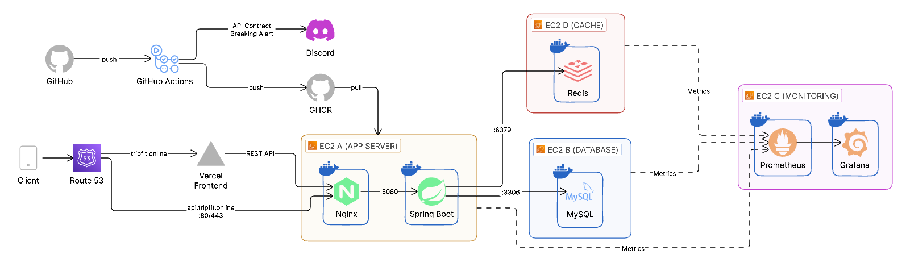
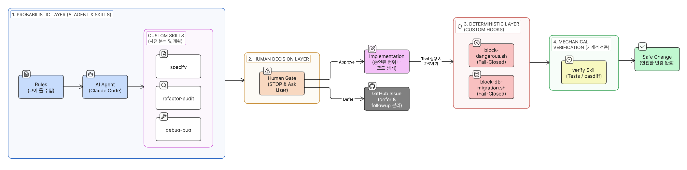
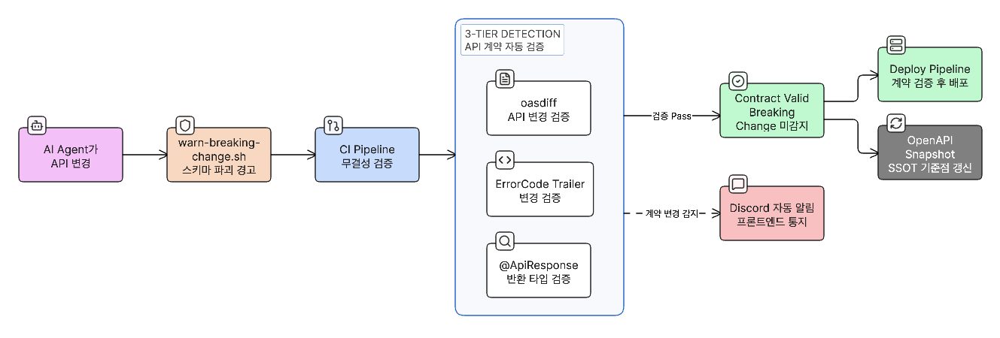

# ✈️ TripFit-server

## 프로젝트 소개

**TripFit**은 그룹 여행에서 참여자들의 일정을 조율하고 최적의 여행 날짜를 추천하는 백엔드 API 서버입니다.

실제 서비스 구축·운영 과정에 **AI Coding Agent를 도입하고, AI의 확률적 판단에만 의존하지 않고 품질과 API 계약을 보장하는 결정론적 검증 시스템을 구축**했습니다.

## 프로젝트 한눈에 보기

| 항목 | 내용 |
|------|------|
| **프로젝트** | TripFit |
| **역할** | Backend 전담 (API 설계·개발, 인프라 배포, 파이프라인 구축) |
| **주요 기능** | 여행 일정 조율 및 날짜 추천 |
| **Backend** | Java 21 · Spring Boot 4.1 |
| **Database** | MySQL 8.0 |
| **Infrastructure** | AWS EC2 · Docker · Nginx |
| **API 서버** | https://api.tripfit.online |
| **Swagger UI** | https://api.tripfit.online/swagger-ui.html |
| **OpenAPI 스냅샷** | [`docs/api/openapi.json`](docs/api/openapi.json) |
| **모니터링** | https://grafana.tripfit.online |
| **프론트엔드 (Web)** | https://tripfit.online |
| **App Store (iOS)** | [ App Store 링크](https://apps.apple.com/kr/app/tripfit-%ED%95%A8%EA%BB%98-%EA%B0%80%EB%8A%94-%EC%97%AC%ED%96%89-%EC%89%AC%EC%9A%B4-%EC%9D%BC%EC%A0%95-%EC%A1%B0%EC%9C%A8/id6791188870) |
| **Google Play** | [▶︎ Google Play 링크](https://play.google.com/store/apps/details?id=com.tripfit.app&pcampaignid=web_share) |

## 핵심 기능

기능 나열을 넘어, 복잡한 요구사항을 풀어내기 위해 다음과 같이 백엔드 로직을 설계했습니다.

- **가중치 기반 추천 엔진** — 개인 근무일정·연차 조건을 반영한 페널티 스코어링으로 4가지 모드별 TOP 3 날짜 후보를 산출하는 로직을 구현했습니다.
- **그룹 일정 조율** — 참여자별 오전/오후/저녁 일정을 종합하여 그룹 전체의 가능한 시간대를 교차 검증하고 시각화 데이터를 제공합니다.
- **소셜 로그인 3종 통합** — 카카오·구글·애플 로그인과 Provider별 토큰 검증 방식을 통합하고, 회원 탈퇴 시 Revoke 정책을 일관되게 처리합니다.
- **여행방 홈 뷰어** — 진행 중/전체 목록을 2-view로 분리하고, Pin 상태 및 최근 활동(`last_activity_at`)을 기준으로 동적 정렬을 수행합니다.
- **알림 스케줄러** — FCM(Firebase Cloud Messaging) 연동 및 배치 스케줄러를 통해 일정 리마인더를 발송합니다.

## 기술 스택

- **Backend:** Java 21 · Spring Boot 4.1 · Spring Data JPA · Gradle
- **Database:** MySQL 8.0 · Flyway · Testcontainers
- **Infrastructure:** Docker · GHCR · AWS EC2 · Nginx
- **Testing / Quality:** JUnit 5 · ArchUnit · oasdiff
- **Observability:** Prometheus · Grafana · Loki
- **AI Engineering:** Claude Code · Skills · Hooks · Subagents

## 주요 기술적 문제 해결

**1. 프론트엔드와의 API 계약 단절 위험 통제**
- **문제:** 백엔드 변경 사항이나 AI가 작성한 코드로 인해 프론트엔드(Vercel)와 백엔드(EC2) 간 API 계약이 예기치 않게 깨지는 위험.
- **해결:** API 명세, 비즈니스 예외, 반환 타입의 정합성을 검증하는 자동화 파이프라인(3-Tier Safety Net)을 CI에 구축.
- **결과:** API Breaking Change가 감지되면 CI를 실패시키도록 구성하여, 검증되지 않은 API 계약 변경이 배포 단계까지 진행되지 않도록 자동화했습니다.

- **문제:** H2나 Mock 객체에 의존할 경우, 실제 MySQL 환경과의 동작 차이로 인해 운영 환경에서만 버그가 발생하는 한계.
- **해결:** `Testcontainers`를 도입하여 모든 테스트가 실제 MySQL 8.0 엔진 위에서 구동되도록 구성.
- **결과:** 실제 MySQL 환경과의 차이로 발생할 수 있는 Dialect 및 제약 조건 관련 오류를 CI 단계에서 조기에 검출할 수 있도록 했습니다.

- **문제:** 서비스가 커질수록 도메인 간 참조로 인해 순환 참조와 의존성 관리가 어려워지는 현상.
- **해결:** Port & Adapter 개념을 차용해 의존성을 역전시키고, `ArchUnit`을 통해 이 규칙을 자동화된 테스트로 강제.
- **결과:** 아키텍처 규칙을 `ArchitectureTest.java`에 정의하고, 테스트 실행 시 위반을 자동 검출하여 빌드가 실패하도록 강제합니다.

## 아키텍처

- **도메인 기반 레이어드** — `auth`, `user`, `trip`, `notification`, `common`으로 분리.
- **의존성 역전** — 도메인 간 호출 시 아웃바운드 인터페이스로 결합도를 완화. (ADR: [`decisions/003`](docs/decisions/003-architecture-guide.md))
- **규칙 강제** — ArchUnit 테스트로 레이어 의존 방향 상시 검증. ([`ArchitectureTest.java`](src/test/java/com/tripfit/tripfit/architecture/ArchitectureTest.java))
- **데이터베이스 설계** — 분산 환경을 고려한 UUID v4 기반 식별자 및 Soft Delete 적용. ([`docs/architecture/erd.md`](docs/architecture/erd.md))
- **배포 인프라** — GitHub Actions ➡️ GHCR ➡️ EC2 Nginx + Spring Boot. (ADR: [`decisions/002`](docs/decisions/002-domain-split-vercel-api.md))

> **프론트엔드(Vercel)와 백엔드(EC2)로 분리된 배포 아키텍처입니다.**

<div align="center">
  
</div>

## AI-Native Backend Engineering

이 프로젝트는 AI 모델을 개발한 프로젝트가 아니라, **AI Coding Agent가 실제 백엔드 코드를 작성하는 개발 환경에서 품질·안전성·API 계약을 보장하는 Engineering 시스템을 구축**한 사례입니다.

상세한 하네스(Harness) 시스템 작동 원리는 [`docs/harness/README.md`](docs/harness/README.md) 및 [`docs/harness/architecture-diagrams.md`](docs/harness/architecture-diagrams.md)를 참고하세요.

### 1. End-to-End Control Loop
**AI의 판단과 실행을 분리하고, 사람의 승인이 필요한 영역과 시스템이 강제해야 하는 영역을 구분했습니다.**

<div align="center">
  
</div>

- **Probabilistic Layer:** AI가 규칙과 스킬을 분석하고 코드를 제안.
- **Human Decision Layer:** 문서와 코드의 불일치 등 중요 판단 시 AI가 사람에게 승인을 요청.
- **Deterministic Layer (Local):** AI가 코드를 작성하거나 명령을 실행하기 전에 로컬 훅(Hooks)이 개입하여, 파괴적인 쉘 명령어 및 승인되지 않은 작업 확정을 사전에 차단.
- **Mechanical Verification (CI):** 작성된 코드가 기존 시스템의 로직이나 API 계약을 망가뜨리지 않았는지 JUnit과 CI 파이프라인을 통해 변경 후 검증.

### 2. AI-Safe API Contract Validation
**AI가 생성한 코드로 인해 Frontend와의 API 계약이 깨지는 것을 방지하기 위해 3중으로 교차 검증합니다.**

<div align="center">
  
</div>

- **oasdiff:** OpenAPI 스키마의 Breaking Change 검증.
- **ErrorCode Trailer:** 합의되지 않은 비즈니스 예외 코드 변경을 Git 레벨에서 통제.
- **@ApiResponse:** 실제 API 반환 타입과 명세 불일치 검증.

### 3. Incident-driven Evolution
초기에는 서브에이전트에게 API Diff 판단까지 맡겼으나, **AI 오판으로 정상적인 커밋이 차단되는 문제**가 발생했습니다. 이 사건을 계기로 **"AI는 판단(Advisory)에 쓰고, 통제(Blocking)는 결정론적 스크립트에 맡긴다"**는 원칙으로 하네스를 재설계했습니다. 실제 개발 과정에서 발생한 실패 사례(Incident)들을 발견하고 자동화된 검증 규칙과 CI로 전환하며 시스템을 진화시켰습니다.

## 프로젝트 구조

```text
com.tripfit.tripfit
├── auth/           # 소셜 로그인 3종·JWT·OAuth
├── user/           # 프로필·온보딩·개인 일정
├── trip/           # 여행방·membership·recommendation·schedule
├── notification/   # FCM·배치 스케줄러
└── common/         # 응답 envelope·예외·베이스 엔티티
```

도메인 내부 구조 등 자세한 내용은 [`docs/architecture.md`](docs/architecture.md)에서 확인하실 수 있습니다.

## 실행 방법

```bash
cp .env.example .env      # 최초 1회 — Auth env 등 설정
docker compose up -d      # MySQL 실행
./gradlew bootRun         # Spring 로컬 실행
./gradlew test            # 전체 테스트 실행
```

배포·검증 스크립트는 [`deploy/README.md`](deploy/README.md)를 참고하세요.

## 문서

| 경로 | 설명 |
|---|---|
| [`docs/harness-engineering.md`](docs/harness-engineering.md) | AI Harness 설계 배경 및 Incident 분석 리포트 |
| [`docs/product/development-wave.md`](docs/product/development-wave.md) | Wave 운영·판단·Backlog SSOT |
| [`docs/specs/`](docs/specs) | 주요 기능별 요구사항 및 설계 스펙 |
| [`docs/decisions/`](docs/decisions) | 인프라 및 아키텍처 결정 기록 (ADR) |
| [`docs/architecture.md`](docs/architecture.md) | 레이어·패키지·데이터베이스 구조 요약 |
| [`deploy/README.md`](deploy/README.md) | 배포 파이프라인 및 서버 구성 가이드 |
| [`.github/CONTRIBUTING.md`](.github/CONTRIBUTING.md) | 커밋, 브랜치 전략 및 PR 규약 |
