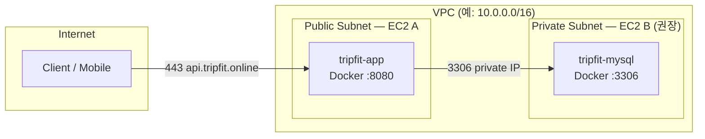

# EC2 2대 분리 배포 가이드 (App / MySQL)

> **빠른 시작·환경변수·검증 스크립트:** [`deploy/README.md`](../deploy/README.md) (배포 SSOT)  
> 이 문서는 VPC·SG·RDS 전환·1→2 EC2 마이그레이션 **심화 가이드**입니다.

> 현재: EC2 1대에서 Spring Boot + MySQL (Docker Compose)  
> 목표: EC2 A (App) + EC2 B (MySQL), 원격 JDBC 연결

## 1. 목표 아키텍처



| 서버 | 역할 | Compose 위치 |
|------|------|--------------|
| EC2 A | Spring Boot | `deploy/app/docker-compose.yml` |
| EC2 B | MySQL 8.0 | `deploy/mysql/docker-compose.yml` |

**왜 분리하는가**

- **장애 격리**: 앱 재배포·OOM과 DB 디스크·백업 부하를 분리
- **스케일 독립**: 트래픽 증가 시 App EC2만 수평 확장 가능 (DB는 별도)
- **보안**: DB를 private subnet에 두고 App SG에서만 3306 허용
- **운영 습관**: 이후 RDS/Aurora 전환 시 App 쪽 변경만 최소화

---

## 2. AWS 네트워크 설계

### 2.1 권장 토폴로지

| 항목 | 권장 | 이유 |
|------|------|------|
| VPC | 1개 (App·DB 동일 VPC) | private IP 통신, SG 단순화 |
| EC2 A subnet | Public | 외부 API 진입 (`api.tripfit.online` → 443) |
| EC2 B subnet | **Private** (NAT 없이도 App→DB만 필요) | DB public 노출 방지 |
| DB 접속 IP | **EC2 B private IP** | SG source를 App SG로 제한 가능 |
| Public IP (DB) | **사용하지 않음** | 3306 인터넷 노출 = 실무에서 금지에 가깝 |

### 2.2 Public vs Private IP

```
App JDBC URL: jdbc:mysql://10.0.1.20:3306/tripfit
                         ^^^^^^^^^^^
                         EC2 B private IP (고정하려면 Elastic IP 아님 — ENI/private IP 유지)
```

| 방식 | 사용 시점 | 문제 |
|------|-----------|------|
| Private IP | **운영·스테이징 기본** | EC2 B 재생성 시 IP 변경 → `.env` 갱신 또는 내부 DNS 필요 |
| Public IP | 로컬 PC에서 DB 직접 접속하는 **임시 dev** | 전 세계 스캔 대상, 반드시 IP 화이트리스트 |

**실무 팁**: EC2 B에 Route 53 Private Hosted Zone `db.tripfit.internal` → private IP A 레코드. IP 변경 시 DNS만 수정.

### 2.3 보안 그룹 (SG)

**EC2 A — App SG (`sg-app`)**

| Direction | Port | Source | 설명 |
|-----------|------|--------|------|
| Inbound | 8080 (또는 443 via ALB) | 0.0.0.0/0 또는 ALB SG | API 트래픽 |
| Inbound | 22 | 관리자 IP / SSM only | SSH는 SSM Session Manager 권장 |
| Outbound | 3306 | `sg-db` | MySQL만 |
| Outbound | 443 | 0.0.0.0/0 | 패키지·이미지 pull |

**EC2 B — DB SG (`sg-db`)**

| Direction | Port | Source | 설명 |
|-----------|------|--------|------|
| Inbound | 3306 | **`sg-app`만** | App EC2에서만 DB 접근 |
| Inbound | 22 | 관리자 IP (또는 SSM) | 긴급 점검 |
| Inbound | 3306 | 관리자 IP | **선택** — mysqldump·점검용, IP 제한 필수 |
| Outbound | — | minimal | DB는 외부 호출 거의 불필요 |

**절대 하지 말 것**: `sg-db` Inbound 3306 ← `0.0.0.0/0`

### 2.4 NACL / 라우팅

- 같은 VPC private subnet 간 통신: 기본 라우팅으로 충분
- EC2 B가 private subnet이면 인터넷에서 직접 3306 불가 → 의도된 설계

---

## 3. EC2 B — MySQL Compose

파일: `deploy/mysql/docker-compose.yml`

핵심 설계:

| 항목 | 설정 | 이유 |
|------|------|------|
| Volume | `mysql_data` named volume | 컨테이너 재생성해도 데이터 유지 |
| Port bind | `${MYSQL_BIND}:3306` | 기본 `127.0.0.1` — SG + `0.0.0.0` bind는 VPC SG와 함께만 |
| binlog 만료 | 86400초 | 디스크 full 재발 방지 |
| healthcheck | mysqladmin ping | 수동 기동 확인용 |
| restart | unless-stopped | EC2 reboot 후 자동 기동 |

**배포 (EC2 B)**

```bash
cd deploy/mysql
cp .env.example .env   # 비밀번호 변경
docker compose up -d
docker compose ps
```

**App 전용 DB 계정 (root 사용 지양)**

```sql
CREATE USER 'tripfit_app'@'%' IDENTIFIED BY 'strong-password';
GRANT SELECT, INSERT, UPDATE, DELETE, CREATE, ALTER, INDEX, DROP
  ON tripfit.* TO 'tripfit_app'@'%';
FLUSH PRIVILEGES;
```

`'%'`는 Docker bridge + VPC 접속 모두 허용. 더 좁히려면 App private IP만 허용하는 `'tripfit_app'@'10.0.1.10'`.

---

## 4. EC2 A — Spring Boot Compose

파일: `deploy/app/docker-compose.yml`

**GHCR 이미지 pull** (EC2 A에서 build 없음). CI/CD가 `main` push 시 이미지를 push하고 SSH로 `docker compose pull && up` 합니다.

| 항목 | 단일 EC2 (루트 compose) | EC2 A 분리 |
|------|-------------------------|------------|
| DB host | `mysql` (service name) | `MYSQL_HOST=<EC2 B private IP>` |
| App 이미지 | `build: .` | `GHCR_IMAGE` pull |
| depends_on mysql | 있음 | **없음** — DB 원격 |
| 배포 스크립트 | `docker compose up -d --build` | `scripts/ec2-deploy-app.sh` 또는 CI SSH |

**배포 (EC2 A)**

```bash
cd deploy/app
cp .env.example .env   # MYSQL_HOST, GHCR_IMAGE, DB 계정 설정
export SPRING_DATASOURCE_USERNAME=...
export SPRING_DATASOURCE_PASSWORD=...
# private GHCR: export GHCR_PAT=... GHCR_USERNAME=...
../../scripts/ec2-deploy-app.sh
```

**검증 (EC2 A — MySQL 컨테이너 없음)**

```bash
../../scripts/verify-deploy-app.sh
```

**환경변수 분리 원칙**

| 변수 | EC2 A (.env) | EC2 B (.env) | Git |
|------|--------------|--------------|-----|
| MYSQL_HOST | ✅ | — | example만 |
| MYSQL_ROOT_PASSWORD | — | ✅ | example만 |
| SPRING_DATASOURCE_* | ✅ | — | example만 |
| 실제 `.env` | 서버에만 | 서버에만 | **커밋 금지** |

---

## 5. application.yml 변경

`application-dev.yml` / `application-prod.yml` (이미 반영):

```yaml
spring:
  datasource:
    url: jdbc:mysql://${MYSQL_HOST:mysql}:${MYSQL_PORT:3306}/${MYSQL_DATABASE:tripfit}?serverTimezone=Asia/Seoul&characterEncoding=UTF-8
    username: ${SPRING_DATASOURCE_USERNAME:root}
    password: ${SPRING_DATASOURCE_PASSWORD}
```

- `MYSQL_HOST` 미설정 시 `mysql` → **단일 EC2 compose 호환 유지**
- 분리 배포: compose environment에 `MYSQL_HOST` 주입

**Hikari (원격 DB)** — `application.yml` 공통값 유지. 원격 시 `connection-timeout`, `keepalive-time`이 더 중요 (네트워크 blip 대비).

---

## 6. EC2 간 통신 테스트

### 6.1 EC2 A → EC2 B 네트워크

```bash
# 1) TCP 3306 (nc 없으면 bash /dev/tcp)
nc -zv 10.0.1.20 3306
# 또는
timeout 3 bash -c 'cat < /dev/null > /dev/tcp/10.0.1.20/3306' && echo OK

# 2) MySQL 클라이언트 (EC2 A에 mysql-client 설치 시)
mysql -h 10.0.1.20 -P 3306 -u tripfit_app -p tripfit -e "SELECT 1;"
```

### 6.2 EC2 B 로컬 (컨테이너)

```bash
docker exec tripfit-mysql mysqladmin ping -h localhost -uroot -p
docker exec tripfit-mysql mysql -uroot -p -e "SHOW DATABASES;"
```

### 6.3 EC2 A — App 헬스

```bash
curl -fsS http://localhost:8080/actuator/health/readiness
docker logs tripfit-app 2>&1 | tail -50
```

### 6.4 실패 시 체크리스트

| 증상 | 확인 |
|------|------|
| Connection refused | EC2 B compose up, port bind, SG 3306 |
| Timeout | SG source, NACL, wrong IP, 다른 VPC |
| Access denied | user/host grant, password |
| Unknown database | MYSQL_DATABASE, 초기 volume |

---

## 7. 운영 관점 리스크

### 7.1 Latency

- 같은 AZ private IP: **~0.1–0.5ms** 추가 — 일반 CRUD에 무시 가능
- **다른 AZ**: 1–3ms+ — App·DB **같은 AZ** 권장 (비용·지연 trade-off)
- Connection pool (Hikari max 10): 원격이어도 pool 재사용으로 handshake 비용 최소화

### 7.2 보안

| 리스크 | 완화 |
|--------|------|
| 3306 public 노출 | private subnet + SG source `sg-app` |
| root DB 계정 | `tripfit_app` least privilege |
| 평문 JDBC | VPC 내부만, TLS는 RDS/EaaS 단계에서 |
| .env 유출 | SSM Parameter Store / Secrets Manager (성장 후) |

### 7.3 장애 영향 범위

| 장애 | 영향 |
|------|------|
| EC2 A down | API 불가, **DB 데이터는 유지** |
| EC2 B down | **API 전면 불가** (DB SPOF) |
| AZ 장애 (같은 AZ 배치) | App+DB 동시 down → **다른 AZ standby 또는 RDS Multi-AZ** |
| 네트워크 blip | Hikari reconnect; `initialization-fail-timeout: -1`은 기동 시 DB 대기 |

**백업 (EC2 B)**

```bash
# cron 예: 매일 mysqldump
docker exec tripfit-mysql mysqldump -uroot -p"$PW" tripfit | gzip > /backup/tripfit-$(date +%F).sql.gz
```

EBS snapshot on `mysql_data` volume — RPO/RTO 요구에 맞게.

---

## 8. 더 나은 운영 구조 비교

| 구조 | 적합 | 장점 | 단점 |
|------|------|------|------|
| **현재 → 2 EC2 Docker** | MVP dev/staging | App/DB 분리, 비용 저렴 | DB SPOF, 백업·패치 직접 |
| **EC2 App + RDS MySQL** | **운영 진입 권장** | 자동 backup, patch, Multi-AZ | 월 ~$15+, VPC/SG 설계 |
| **EC2 App + Aurora** | 트래픽 성장 | read replica, failover | 비용↑ |
| **ECS/Fargate + RDS** | 배포 자동화 | 무중단 배포, 스케일 | 학습·구성 비용 |
| **Elastic Beanstalk + RDS** | 빠른 PaaS | Heroku 대체, 관리형 | 커스터마이즈 제한 |

**RDS 전환 시 App 변경량**

```yaml
# .env 만 변경 (예)
MYSQL_HOST=tripfit.xxxx.ap-northeast-2.rds.amazonaws.com
MYSQL_PORT=3306
```

JDBC URL 패턴 동일 → **2 EC2 Docker 분리는 RDS로 가는 중간 단계**로 적합.

---

## 9. 마이그레이션 절차 (1 EC2 → 2 EC2)

1. **EC2 B** provision (private subnet, `sg-db`)
2. `deploy/mysql` compose up, DB 기동 확인
3. 기존 1 EC2에서 dump → EC2 B restore (또는 빈 DB면 App `ddl-auto: update`로 재생성)
4. **EC2 A** provision (`sg-app`), `deploy/app` `.env`에 EC2 B private IP
5. EC2 A에서 `nc` / `mysql` 연결 테스트
6. App compose up, health/readiness 확인
7. DNS/ALB를 EC2 A로 전환
8. 구 1 EC2는 dump 검증 후 종료

---

## 10. 프로젝트 파일 맵

배포 파일·스크립트 목록은 [`deploy/README.md`](../../deploy/README.md)를 참고하세요.

**분리 환경 검증 (EC2 A)**

```bash
./scripts/verify-deploy-app.sh
```

---

## 11. 요약

- **Private IP + SG(source=App SG)** 가 실무 기본; public 3306은 임시 dev만
- Compose는 **역할별 분리** (`deploy/mysql`, `deploy/app`); 단일 EC2 compose는 로컬용 유지
- DB host는 **환경변수 `MYSQL_HOST`** 로 주입 — 코드 변경 없이 RDS 전환 가능
- 2 EC2 Docker DB는 **SPOF** — 운영 본격화 시 **RDS Multi-AZ**가 다음 단계
