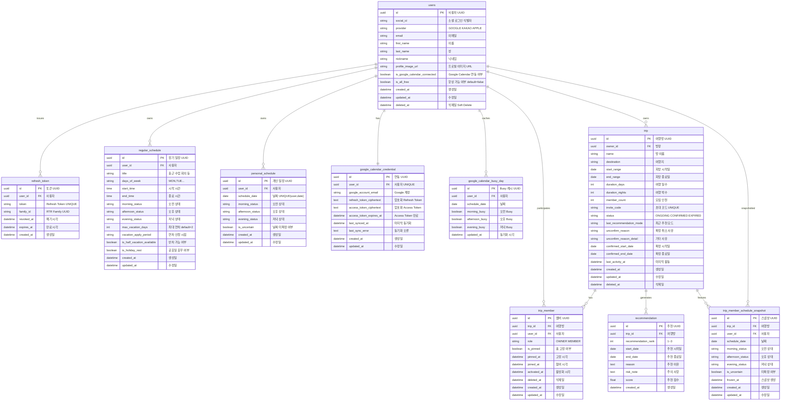

# TripFit ERD

> NotebookLM 03 + 2026-07-08 확정 병합. 비즈니스 규칙: `docs/product/business-rules/`.
> **구현 상태:** wave 1 UUID PK 전환 완료. wave 2 `#11` — **정기/개별 2테이블** (`regular_schedule` · `personal_schedule`). A안 단일 `schedule` 폐기. 여행방 CRUD·추천은 후속 이슈.

## 1. 개요

- **데이터 모델 설계 목적:** 다수 참여자 일정 수집·가중치 기반 추천·확정을 지원하는 MVP 데이터 구조
- **설계 원칙:**
    - **snake_case**, **단수형** 테이블명 (`users`만 복수 — MySQL 예약어 `user` 회피)
    - **Soft delete:** `users`, `trip`, `trip_member` — `deleted_at`
    - **UUID v4 PK** (`char(36)`), BR-* 및 백엔드 확정 사항 반영 — [`uuid-primary-key.md`](../specs/uuid-primary-key.md)
    - **User 전역 일정:** `regular_schedule`(정기) + `personal_schedule`(개별) — 모든 여행방에 자동 반영 (BR-USER-008)
- **대상 DB:** MySQL 8.0 (예약어 `rank` 등 — JPA `@Column` 명시. 구 `user` 테이블 → **`users`**)

## 2. Mermaid ERD (정기·개별 분리 — SSOT)

## 3. 테이블 정의 (MVP In Scope)

### `users`

- **관련 BR:** BR-USER-001, BR-USER-003(wave 4)
- **관련 결정:** [`007-user-profile-onboarding.md`](../decisions/007-user-profile-onboarding.md), [`006-profile-image-url-storage.md`](../decisions/006-profile-image-url-storage.md)
- **테이블명:** `users` (MySQL 예약어 `user` 회피). Java 엔티티는 `User`.

| 컬럼 | 타입 | Nullable | PK/FK | 설명 |
|------|------|----------|-------|------|
| id | char(36) | N | PK | UUID v4 |
| social_id | varchar | N | | |
| provider | varchar | N | | KAKAO, GOOGLE, APPLE |
| email | varchar | Y | | UNIQUE 아님 |
| first_name | varchar | Y | | PATCH onboarding/name 필수 |
| last_name | varchar | Y | | PATCH onboarding/name 필수 |
| nickname | varchar | Y | | 소셜 prefill, fallback 없음 |
| profile_image_url | varchar | Y | | wave 1 CDN / wave 4 S3 B안 |
| is_google_calendar_connected | boolean | N | | default false |
| is_all_free | boolean | N | | default false. 전부 free 선언. row≥1이면 false 강제 |
| created_at | timestamptz | N | | |
| updated_at | timestamptz | N | | |
| deleted_at | timestamptz | Y | | Soft delete |

**API 파생·컬럼:** `hasPreSchedule` = EXISTS(regular) OR EXISTS(personal) (파생). **`users.is_all_free`** boolean default `false` — login/me `isAllFree`. 입장 = 정기 OR 개별 OR `is_all_free` ([`schedule-participation-onboarding.md`](../specs/schedule-participation-onboarding.md)). ~~`is_schedule_registered`~~ **제거**.

### `refresh_token`

wave 1+. [`004-auth-token-rotation.md`](../decisions/004-auth-token-rotation.md), [`auth-token-rotation.md`](../specs/auth-token-rotation.md)

| 컬럼 | 타입 | Nullable | PK/FK | 설명 |
|------|------|----------|-------|------|
| id | char(36) | N | PK | UUID v4 |
| user_id | char(36) | N | FK → users.id | |
| token | varchar(255) | N | | UNIQUE |
| family_id | char(36) | N | | UUID |
| revoked_at | timestamptz | Y | | wave 4 RTR |
| expires_at | timestamptz | N | | |
| created_at | timestamptz | N | | |

### `regular_schedule` (정기 일정)

User 소유. 출근·수업·회의 등 **복수 행**. **trip FK 없음** (BR-USER-008).

- **관련 BR:** BR-TRIP-006, BR-USER-006, BR-USER-008

| 컬럼 | 타입 | Nullable | PK/FK | 설명 |
|------|------|----------|-------|------|
| id | char(36) | N | PK | UUID v4 |
| user_id | char(36) | N | FK → users.id | |
| title | varchar | N | | 출근·수업·회의 등 표시명 |
| days_of_week | varchar | Y | | `MON,TUE,...` |
| start_time | time | Y | | |
| end_time | time | Y | | |
| morning_status | varchar | Y | | 계산: MORNING 슬롯 POSSIBLE/IMPOSSIBLE |
| afternoon_status | varchar | Y | | AFTERNOON |
| evening_status | varchar | Y | | EVENING |
| max_vacation_days | int | N | | default **2**, 허용 **0~10** |
| vacation_apply_period | varchar | Y | | enum: `ANY` · `ONE_WEEK_BEFORE` · `TWO_WEEKS_BEFORE` · `ONE_MONTH_BEFORE`. default **null** |
| is_half_vacation_available | boolean | N | | default **false** (N) |
| is_holiday_rest | boolean | N | | default **true** (Y) |
| created_at | timestamptz | N | | |
| updated_at | timestamptz | N | | |

**제약:** user당 **0..N행**. 1행 이상 → 입장 조건 1 충족 (D-JOIN-ENTRY). soft delete 없음.

### `personal_schedule` (개인 일정)

User 소유. **날짜당 1행** — 오전/오후/저녁 가능·불가 + 날짜 단위 불확실. **trip FK 없음.**

- **관련 BR:** BR-TRIP-002, BR-TRIP-003, BR-TRIP-004, BR-USER-008

| 컬럼 | 타입 | Nullable | PK/FK | 설명 |
|------|------|----------|-------|------|
| id | char(36) | N | PK | UUID v4 |
| user_id | char(36) | N | FK → users.id | |
| schedule_date | date | N | | |
| morning_status | varchar | N | | POSSIBLE / IMPOSSIBLE (`SlotStatuses`) |
| afternoon_status | varchar | N | | POSSIBLE / IMPOSSIBLE |
| evening_status | varchar | N | | POSSIBLE / IMPOSSIBLE |
| is_uncertain | boolean | N | | **날짜 전체** 불확실 (슬롯별 TBD 아님) |
| created_at | timestamptz | N | | |
| updated_at | timestamptz | N | | |

**제약:** `UNIQUE (user_id, schedule_date)`. soft delete 없음.

**시간대 (BR-TRIP-002, 확정):** MORNING `[00:00,13:00)`, AFTERNOON `[13:00,18:00)`, EVENING `[18:00,24:00)` — 공통 `TimeSlot` + `SlotStatuses` (정기와 동일)

**trip 조회:** `trip.start_range`~`end_range`로 해당 user의 `personal_schedule` 행 필터

### `google_calendar_credential` (Google Calendar OAuth)

User당 **1행**. refresh·access token AES-256-GCM 암호화 저장. [`google-calendar-oauth.md`](../specs/google-calendar-oauth.md)

| 컬럼 | 타입 | Nullable | PK/FK | 설명 |
|------|------|----------|-------|------|
| id | char(36) | N | PK | UUID v4 |
| user_id | char(36) | N | FK → users.id, **UNIQUE** | |
| google_account_email | varchar(255) | Y | | 연동된 구글 계정 이메일 (재연동 UX·운영 추적용) |
| refresh_token_ciphertext | text | N | | AES-256-GCM 암호문 (Base64) |
| access_token_ciphertext | text | N | | access token AES-256-GCM 암호문 (Base64, 캐시) |
| access_token_expires_at | timestamptz | Y | | access token 만료 시각 (UTC) |
| last_synced_at | timestamptz | Y | | 마지막 freeBusy sync 시각 |
| last_sync_error | text | Y | | 내부용 |
| created_at | timestamptz | N | | |
| updated_at | timestamptz | N | | |

### `google_calendar_busy_day` (Google freeBusy 캐시)

날짜×슬롯 busy boolean. **sparse** — busy 슬롯이 있는 날만 저장. C1 윈도우(`today`~`today+2년−1`) 내 sync.

| 컬럼 | 타입 | Nullable | PK/FK | 설명 |
|------|------|----------|-------|------|
| id | char(36) | N | PK | UUID v4 |
| user_id | char(36) | N | FK → users.id | |
| schedule_date | date | N | | Asia/Seoul |
| morning_busy | boolean | N | | |
| afternoon_busy | boolean | N | | |
| evening_busy | boolean | N | | |
| updated_at | timestamptz | N | | |

**제약:** `UNIQUE (user_id, schedule_date)`

### `trip`

- **관련 BR:** BR-TRIP-001, 007–011

| 컬럼 | 타입 | Nullable | PK/FK | 설명 |
|------|------|----------|-------|------|
| id | char(36) | N | PK | UUID v4 |
| owner_id | char(36) | N | FK → users.id | 방장 |
| name | varchar | N | | 최대 **15자** (BR-TRIP-001) |
| destination | varchar | Y | | 여행지. null = 「아직 못정했어요」 |
| start_range | date | N | | 희망 기간 시작. **생성 후 수정 불가** |
| end_range | date | N | | 희망 기간 종료. **생성 후 수정 불가** |
| duration_days | int | Y | | m일. null = 일정 미정. `duration_nights`와 쌍으로 저장 |
| duration_nights | int | Y | | n박. null = 일정 미정. 요청 시 `durationNights`+`durationDays` 검증 후 **둘 다 컬럼에 저장**(파생 아님) |
| member_count | int | N | | **1~10** (BR-TRIP-001) |
| invite_code | varchar | N | | UNIQUE |
| status | varchar | N | | `ONGOING`, `CONFIRMED`, `EXPIRED`(기간 만료·종료) — 구 `CANCELED`는 삭제, 구 `TERMINATED`는 `EXPIRED`로 리네임(#48) |
| last_recommendation_mode | varchar | Y | | BASIC, ALL_ATTEND, SAVE_VACATION, CERTAIN |
| unconfirm_reason | varchar | Y | | `unconfirm` 사유 enum. **wave 2**(#13) — 최신값만 저장(이력 아님) |
| unconfirm_reason_detail | varchar | Y | | `unconfirm_reason=OTHER`일 때만 직접 입력 텍스트 |
| confirmed_start_date | date | Y | | |
| confirmed_end_date | date | Y | | |
| last_activity_at | timestamptz | N | | 홈 정렬용 최근 활동. 생성·join·patch·**confirm**·추천·확정 시 갱신 ([`trip-room-api.md`](../specs/trip-room-api.md) D5 · #39) |
| created_at | timestamptz | N | | |
| updated_at | timestamptz | N | | |
| deleted_at | timestamptz | Y | | Soft delete |

**제약:** `duration_days`가 있을 때 `duration_nights+1 ≤ duration_days ≤ min(duration_nights+2, T)` (T=`end_range - start_range + 1`, BR-TRIP-001·BR-TRIP-008). **당일치기(0박) 허용** — `duration_nights=0`일 때 `duration_days`는 1 또는 2 · [#2](https://github.com/Central-MakeUs/TripFit-server/issues/2) 확정 (2026-07-21), 범위 확장 (2026-07-26).

### `trip_member`

방별 **참여·일정 확인** 상태. 일정 데이터는 User `personal_schedule`/`regular_schedule`에 있음 (BR-USER-007 · #39).

- **관련 BR:** BR-USER-002, BR-USER-007
- **관련 스펙:** [`trip-room-api.md`](../specs/trip-room-api.md) D1 (#39), [`schedule-participation-onboarding.md`](../specs/schedule-participation-onboarding.md)

| 컬럼 | 타입 | Nullable | PK/FK | 설명 |
|------|------|----------|-------|------|
| id | char(36) | N | PK | UUID v4 |
| trip_id | char(36) | N | FK → trip.id | |
| user_id | char(36) | N | FK → users.id | NOT NULL |
| role | varchar | N | | OWNER, MEMBER |
| is_pinned | boolean | N | | default false. **진행 중 캐러셀** 고정 (MVP In, wave 2 · D5) |
| pinned_at | timestamptz | Y | | Pin ON 시각. OFF면 null. Pin 그룹 내 정렬용 (D5) |
| joined_at | timestamptz | N | | 멤버 row 생성 시각 (방장=create, 멤버=join) |
| activated_at | timestamptz | Y | | 일정 확인·가입 완료 시각. **SCHEDULE_PENDING면 null**, confirm/join(ACTIVE) 시 set. **`status`(SCHEDULE_PENDING/ACTIVE) 파생 SSOT — 별도 컬럼 없음**(`TripMember.getStatus()`가 null 여부로 계산). `SCHEDULE_PENDING`=방장 전용(create 직후·confirm 전, 입장·공유 불가), `ACTIVE`=방장 confirm 후·멤버 join 시(입장 가능, `canEnterRoom`도 필요). 멤버는 중간 SCHEDULE_PENDING 없음 |
| deleted_at | timestamptz | Y | | **trip soft delete 시 연쇄 soft** |
| created_at | timestamptz | N | | |
| updated_at | timestamptz | N | | |

**활성 유일성:** `(trip_id, user_id)` where `deleted_at IS NULL` — **앱 레이어 강제** (`findByTripIdAndUserIdAndDeletedAtIsNull`). MySQL은 partial unique 미지원 → JPA `@UniqueConstraint` **없음**. soft-deleted row 재가입(신규 INSERT) 허용.

동명이인 `(2)` 표시: **DB 컬럼 없음** — BR-USER-009 조회 로직

**카운트:** 내부적으로는 `joinedMemberCount`(soft-delete 제외 전 멤버, SCHEDULE_PENDING 포함)와 `activeMemberCount`(`ACTIVE`만)를 둘 다 집계하지만, **API로는 `activeMemberCount`만 노출**(`joinedMemberCount`는 응답 필드 아님 — 참여 인원이 필요하면 `membersPreview.size() + membersPreviewOverflow` 또는 멤버 목록 배열 크기로 유도). `memberFillRate`(응답률) = `activeMemberCount ÷ memberCount`. 상세: [`trip-member-fill-rate-refactor.md`](../specs/trip-member-fill-rate-refactor.md)

### `trip_member_schedule_snapshot` (#38)

완료(CONFIRMED)·만료(EXPIRED) 방의 **멤버×날짜 effective** 고정본. 희망 기간·sparse. live `regular`/`personal`과 분리 (BR-USER-008).

- **관련 스펙:** [`trip-schedule-snapshot.md`](../specs/trip-schedule-snapshot.md)

| 컬럼 | 타입 | Nullable | PK/FK | 설명 |
|------|------|----------|-------|------|
| id | char(36) | N | PK | UUID v4 |
| trip_id | char(36) | N | FK → trip.id | |
| user_id | char(36) | N | FK → users.id | |
| schedule_date | date | N | | |
| morning_status | varchar | Y | | POSSIBLE/IMPOSSIBLE |
| afternoon_status | varchar | Y | | |
| evening_status | varchar | Y | | |
| is_uncertain | boolean | N | | |
| frozen_at | timestamptz | N | | freeze 시각 |
| created_at | timestamptz | N | | |
| updated_at | timestamptz | N | | |

**UNIQUE:** `(trip_id, user_id, schedule_date)`

### `recommendation`

**현재 모드 TOP 3만** 유지 (BR-TRIP-005). 갱신 시 **hard DELETE** 후 INSERT (BR-TRIP-010).

- **관련 BR:** BR-TRIP-005, 011, 012

| 컬럼 | 타입 | Nullable | PK/FK | 설명 |
|------|------|----------|-------|------|
| id | char(36) | N | PK | UUID v4 |
| trip_id | char(36) | N | FK → trip.id | |
| recommendation_rank | int | N | | 1, 2, 3 (`rank` 예약어 회피) |
| start_date | date | N | | |
| end_date | date | N | | |
| reason | text | Y | | 추천 근거 |
| risk_note | text | Y | | |
| score | float | Y | | #13 순위·동점 비교 ([`trip-recommendation.md`](../specs/trip-recommendation.md)) |
| created_at | timestamptz | N | | |

**정책:** 모드 변경·trip 기간/일수 변경·trip soft delete → 해당 trip `recommendation` **hard DELETE**. `trip.last_recommendation_mode` 갱신.

## 4. 관계 요약

| From | To | 관계 | 설명 |
|------|-----|------|------|
| users | regular_schedule | 1:N | 정기 일정 (출근·수업·회의 등) |
| users | personal_schedule | 1:N | 개인 일정 (날짜당 1행) |
| users | trip_member | 1:N | 여행방별 참여 |
| users | trip | 1:N | owner_id (방장) |
| users | refresh_token | 1:N | |
| trip | trip_member | 1:N | |
| trip | trip_member_schedule_snapshot | 1:N | #38 CONFIRMED/EXPIRED effective freeze |
| users | trip_member_schedule_snapshot | 1:N | |
| trip | recommendation | 1:N | 최대 3 (현재 모드) |

## 5. MVP 범위와의 매핑

| MVP 기능 | 테이블 |
|----------|--------|
| 소셜 로그인·프로필 | `users`, `refresh_token` |
| 정기·개별 일정 | `regular_schedule`, `personal_schedule` |
| 여행방·초대·여행지 | `trip`, `trip_member` |
| 추천 4모드·TOP3·확정 | `recommendation`, `trip.last_recommendation_mode`, `trip.confirmed_*` |

**Out of Scope (향후)**

- `notification_history` — BR-NOTI-* (wave 3+)
- `trip_expense`, `reservation` 등

## 6. 삭제·갱신 정책 (확정)

| 대상 | 정책 |
|------|------|
| `trip` soft delete | `trip_member` **연쇄 soft delete**. 정기·개별 일정·User 데이터 **유지** |
| `recommendation` | 옵션/기간 변경·모드 변경·trip delete → **hard DELETE** |
| `regular_schedule` · `personal_schedule` | User 소유 — trip 삭제와 **무관** |
| 전역 연동 | 개별·정기 변경 → 모든 참여 trip의 추천 입력 즉시 반영 (재계산은 BR-TRIP-010) |

## 7. 폐기 — A안 단일 `schedule`

2026-07-13 이전 SSOT였던 `schedule` + `row_type` 단일 테이블은 **폐기**.
현재 SSOT는 §2~3 `regular_schedule` + `personal_schedule`. (구 B안 `user_work_profile` 명칭은 쓰지 않음 — 정기 일정은 근무 전용 아님)

## 8. 미정 / 구현 전

| 항목 | 내용 |
|------|------|
| `[미정]` | BR-TRIP-005 가중치 · BR-TRIP-012 동점 · EXPIRED **전환 시점**(lazy vs 배치) |
| wave 2 잔여 | `#12` trip CRUD · members schedule-calendar · `#13` 추천 |
| wave 4 | 여행방 **삭제** 시 VOC 사유 API·UI (unconfirm 사유와 별개) |

## 기획 메모 (NotebookLM + 확정)

1. **MVP 핵심:** `users`, `regular_schedule`, `personal_schedule`, `trip`, `trip_member`, `recommendation` + `refresh_token`
2. **2026-07-08:** TERMINATED, Pin(`is_pinned`), cancel_reason wave 4, 전역 연동
3. **2026-07-13:** A안 폐기 → 정기/개별 2테이블, 정기 N행·title·범용 시간 필드
4. **2026-07-20:** 홈 D5 — `trip.last_activity_at`, `trip_member.pinned_at` ([`trip-room-api.md`](../specs/trip-room-api.md))
5. **2026-07-21:** `#39` — `trip_member.status` **SCHEDULE_PENDING|ACTIVE** 부활 (방장 create=`SCHEDULE_PENDING` → confirm=`ACTIVE`)
6. **2026-07-21:** `trip.duration_days` **nullable**(일정 미정) · 희망 기간 생성 후 불변 · API n박+m일
6. **2026-07-21:** ERD 개선 반영 — `users` rename · `responded_at` · active UNIQUE(app) · `score`=#13 유지
7. 알림 이력 테이블 — ERD 범위 외 (wave 3)
8. **2026-07-26:** `trip.duration_nights` 파생값 → 컬럼 영속화, 박/일 검증 범위 `nights+1~min(nights+2,T)`로 확장 ([`trip-duration-range.md`](../specs/trip-duration-range.md))
9. **2026-08-01:** `TripMemberStatus` 개명(`JOINED`→`SCHEDULE_PENDING`, `RESPONDED`→`ACTIVE`, [`trip-member-status-derive.md`](../specs/trip-member-status-derive.md))에서 빠졌던 후속 정리 — `trip_member.responded_at`→`activated_at`, `markResponded()`→`activate()`, API 필드 `respondedCount`→`activeMemberCount`로 일괄 개명(이름을 상태 enum과 일치시켜 혼동 제거, 네이밍 우선 원칙)
10. **2026-07-28 (#60):** `memberFillRate` 공식을 `joinedMemberCount ÷ memberCount` → `activeMemberCount ÷ memberCount`로 전환, `joinedMemberCount` API 미노출로 전환 · 여행방 상세에 `membersPreview`/`membersPreviewOverflow` 추가 ([`trip-member-fill-rate-refactor.md`](../specs/trip-member-fill-rate-refactor.md))
