# TripFit ERD

> NotebookLM 03 + 2026-07-08 확정 병합. 비즈니스 규칙: `docs/product/business-rules/`.
> **구현 상태:** wave 1 UUID PK 전환 완료. wave 2 `#11` — **정기/개별 2테이블** (`regular_schedule` · `personal_schedule`). A안 단일 `schedule` 폐기. 여행방 CRUD(`#12`)·추천 4모드·확정·확정취소(`#13`·`#50`) 구현 완료.

## 1. 개요

- **데이터 모델 설계 목적:** 다수 참여자 일정 수집·가중치 기반 추천·확정을 지원하는 MVP 데이터 구조
- **설계 원칙:**
    - **snake_case**, **단수형** 테이블명 (`users`만 복수 — MySQL 예약어 `user` 회피)
    - **Soft delete:** `users`, `trip`, `trip_member` — `deleted_at`
    - **UUID v4 PK** (`char(36)`), BR-* 및 백엔드 확정 사항 반영 — [`uuid-primary-key.md`](../specs/cross-cutting/uuid-primary-key.md)
    - **User 전역 일정:** `regular_schedule`(정기) + `personal_schedule`(개별) — 모든 여행방에 자동 반영 (BR-USER-008)
- **대상 DB:** MySQL 8.0 (예약어 `rank` 등 — JPA `@Column` 명시. 구 `user` 테이블 → **`users`**)

## 2. Mermaid ERD (정기·개별 분리 — SSOT)

```mermaid
erDiagram
users ||--o{ regular_schedule : owns
users ||--o{ personal_schedule : owns
users ||--|| google_calendar_credential : has
users ||--o{ google_calendar_busy_day : caches
users ||--|| apple_credential : has
users ||--|| google_login_credential : has
users ||--o{ trip_member : participates
users ||--o{ trip : owns
trip ||--o{ trip_member : has
trip ||--o{ recommendation : generates
trip ||--o{ recommendation_feedback : receives
trip ||--o{ trip_member_schedule_snapshot : freezes
users ||--o{ trip_member_schedule_snapshot : snapshotted
users ||--o{ user_device_token : registers
users ||--o{ notification_history : receives
trip ||--o{ notification_history : relates_to

    users {
        uuid id PK "사용자 UUID"
        string social_id "소셜 로그인 식별자"
        string provider "GOOGLE KAKAO APPLE"
        string email "이메일"
        string first_name "이름"
        string last_name "성"
        string nickname "닉네임"
        string profile_image_url "프로필 이미지 URL"
        boolean is_google_calendar_connected "Google Calendar 연동 여부"
        boolean is_all_free "항상 가능 여부 default=false"
        boolean notification_enabled "알림 수신 여부 default=true BR-USER-005"
        datetime created_at "생성일"
        datetime updated_at "수정일"
        datetime deleted_at "삭제일 Soft Delete"
    }

    regular_schedule {
        uuid id PK "정기 일정 UUID"
        uuid user_id FK "사용자"
        string title "출근 수업 회의 등"
        string days_of_week "MON,TUE..."
        time start_time "시작 시간"
        time end_time "종료 시간"
        string morning_status "오전 상태"
        string afternoon_status "오후 상태"
        string evening_status "저녁 상태"
        int max_vacation_days "최대 연차 default=2"
        string vacation_apply_period "연차 신청 시점"
        boolean is_half_vacation_available "반차 가능 여부"
        boolean is_holiday_rest "공휴일 휴무 여부"
        datetime created_at "생성일"
        datetime updated_at "수정일"
    }

    personal_schedule {
        uuid id PK "개인 일정 UUID"
        uuid user_id FK "사용자"
        date schedule_date "날짜 UNIQUE(user,date)"
        string morning_status "오전 상태"
        string afternoon_status "오후 상태"
        string evening_status "저녁 상태"
        boolean is_uncertain "날짜 미확정 여부"
        datetime created_at "생성일"
        datetime updated_at "수정일"
    }

    google_calendar_credential {
        uuid id PK "연동 UUID"
        uuid user_id FK "사용자 UNIQUE"
        string google_account_email "Google 계정"
        text refresh_token_ciphertext "암호화 Refresh Token"
        text access_token_ciphertext "암호화 Access Token"
        datetime access_token_expires_at "Access Token 만료"
        datetime last_synced_at "마지막 동기화"
        text last_sync_error "동기화 오류"
        datetime created_at "생성일"
        datetime updated_at "수정일"
    }

    apple_credential {
        uuid id PK "credential UUID"
        uuid user_id FK "사용자 UNIQUE"
        text refresh_token_ciphertext "암호화 Refresh Token"
        string apple_client_id "로그인 시 검증된 Bundle ID 또는 Services ID"
        datetime created_at "생성일"
        datetime updated_at "수정일"
    }

    google_login_credential {
        uuid id PK "credential UUID"
        uuid user_id FK "사용자 UNIQUE"
        text refresh_token_ciphertext "암호화 Refresh Token"
        datetime created_at "생성일"
        datetime updated_at "수정일"
    }

    google_calendar_busy_day {
        uuid id PK "Busy 캐시 UUID"
        uuid user_id FK "사용자"
        date schedule_date "날짜"
        boolean morning_busy "오전 Busy"
        boolean afternoon_busy "오후 Busy"
        boolean evening_busy "저녁 Busy"
        datetime updated_at "동기화 시각"
    }

    trip {
        uuid id PK "여행방 UUID"
        uuid owner_id FK "방장"
        string name "방 이름"
        string destination "여행지"
        date start_range "희망 시작일"
        date end_range "희망 종료일"
        int duration_days "여행 일수"
        int duration_nights "여행 박수"
        int member_count "모집 인원"
        string invite_code "초대 코드 UNIQUE"
        string status "ONGOING CONFIRMED EXPIRED"
        string last_recommendation_mode "최근 추천 모드"
        string unconfirm_reason "확정 취소 사유"
        string unconfirm_reason_detail "기타 사유"
        date confirmed_start_date "확정 시작일"
        date confirmed_end_date "확정 종료일"
        int confirmed_attend_count "확정 시점 참석 인원수"
        int confirmed_vacation_member_count "확정 시점 연차 필요 인원수"
        int confirmed_uncertain_count "확정 시점 불확실 인원수"
        datetime last_activity_at "마지막 활동"
        datetime created_at "생성일"
        datetime updated_at "수정일"
        datetime deleted_at "삭제일"
    }

    trip_member {
        uuid id PK "멤버 UUID"
        uuid trip_id FK "여행방"
        uuid user_id FK "사용자"
        string role "OWNER MEMBER"
        boolean is_pinned "홈 고정 여부"
        datetime pinned_at "고정 시각"
        datetime joined_at "참여 시각"
        datetime activated_at "활성화 시각"
        datetime deleted_at "삭제일"
        datetime created_at "생성일"
        datetime updated_at "수정일"
    }

    trip_member_schedule_snapshot {
        uuid id PK "스냅샷 UUID"
        uuid trip_id FK "여행방"
        uuid user_id FK "사용자"
        date schedule_date "날짜"
        string morning_status "오전 상태"
        string afternoon_status "오후 상태"
        string evening_status "저녁 상태"
        boolean is_uncertain "미확정 여부"
        datetime frozen_at "스냅샷 생성"
        datetime created_at "생성일"
        datetime updated_at "수정일"
    }

    recommendation {
        uuid id PK "추천 UUID"
        uuid trip_id FK "여행방"
        int recommendation_rank "1~3"
        date start_date "추천 시작일"
        date end_date "추천 종료일"
        int attend_rate "참석률(%)"
        int partial_attend_count "부분 참석 인원수"
        int uncertain_count "불확실 인원수"
        float total_vacation_days "총 연차 일수"
        float score "추천 점수(내부용)"
        datetime created_at "생성일"
    }

    recommendation_feedback {
        uuid id PK "피드백 UUID"
        uuid trip_id FK "여행방"
        uuid recommendation_id "대상 recommendation(FK 아님, soft reference)"
        string mode "피드백 시점 모드 스냅샷"
        int recommendation_rank "피드백 시점 순위 스냅샷"
        date start_date "피드백 시점 시작일 스냅샷"
        date end_date "피드백 시점 종료일 스냅샷"
        string status "HELPFUL NOT_HELPFUL"
        string reason "도움 안 된 이유"
        text reason_detail "기타 사유"
        datetime created_at "생성일"
        datetime updated_at "수정일"
    }

    user_device_token {
        uuid id PK "토큰 UUID"
        uuid user_id FK "소유 사용자 — 재로그인 시 재할당(D7)"
        string token "FCM 등록 토큰 UNIQUE"
        string device_type "ANDROID IOS WEB"
        datetime created_at "생성일"
        datetime updated_at "수정일"
    }

    notification_history {
        uuid id PK "알림 이력 UUID"
        uuid user_id FK "수신자"
        uuid trip_id FK "관련 여행방 — 여행방 무관 알림(리마인드)은 null"
        string type "JOIN_COMPLETED 등 BR-NOTI-*"
        string title "알림 제목"
        string body "알림 본문"
        string landing_type "TRAVEL_ROOM_DETAIL SCHEDULE_MANAGEMENT"
        boolean is_read "읽음 여부 default=false"
        datetime read_at "읽은 시각"
        datetime sent_at "발송 시각"
        datetime created_at "생성일"
        datetime updated_at "수정일"
    }
```

## 3. 테이블 정의 (MVP In Scope)

### `users`

- **관련 BR:** BR-USER-001, BR-USER-003(wave 4)
- **관련 결정:** [`007-user-profile-onboarding.md`](../decisions/007-user-profile-onboarding.md), [`006-profile-image-url-storage.md`](../decisions/006-profile-image-url-storage.md)
- **테이블명:** `users` (MySQL 예약어 `user` 회피). Java 엔티티는 `User`.

| 컬럼 | 타입 | Nullable | PK/FK | 설명 |
|------|------|----------|-------|------|
| id | char(36) | N | PK | UUID v4 |
| social_id | varchar | N | | |
| provider | varchar | N | | KAKAO, GOOGLE, APPLE |
| email | varchar | Y | | UNIQUE 아님 |
| first_name | varchar | Y | | PATCH onboarding/name 필수 |
| last_name | varchar | Y | | PATCH onboarding/name 필수 |
| nickname | varchar | Y | | 소셜 prefill, fallback 없음 |
| profile_image_url | varchar | Y | | wave 1 CDN / wave 4 S3 B안 |
| is_google_calendar_connected | boolean | N | | default false |
| is_all_free | boolean | N | | default false. 전부 free 선언. row≥1이면 false 강제 |
| created_at | timestamptz | N | | |
| updated_at | timestamptz | N | | |
| deleted_at | timestamptz | Y | | Soft delete |

**API 파생·컬럼:** `hasPreSchedule` = EXISTS(regular) OR EXISTS(personal) (파생). **`users.is_all_free`** boolean default `false` — login/me `isAllFree`. 입장 = 정기 OR 개별 OR `is_all_free` ([`schedule-participation-onboarding.md`](../specs/trip/schedule-participation-onboarding.md)). ~~`is_schedule_registered`~~ **제거**.

### `refresh_token` — MySQL 테이블 아님 (Redis 이관, 2026-09-15)

RTR(rotate·reuse detection) refresh token은 더 이상 MySQL 테이블이 아니라 **Redis 키**로 저장한다 — 이 ERD(RDB 스키마) 대상에서 제외. 키 설계·rotate 흐름은 [`auth-refresh-redis-cookie.md`](../specs/auth/auth-refresh-redis-cookie.md)가 SSOT, 이전 MySQL 기반 설계는 [`004-auth-token-rotation.md`](../decisions/004-auth-token-rotation.md)·[`auth-token-rotation.md`](../specs/auth/auth-token-rotation.md)에 이력으로 남아 있다.

**Redis (`#4`):** access token(JWT) `jti` 블랙리스트 `auth:bl:{jti}` — logout·탈퇴 시 등록, TTL=토큰 잔여 수명. 별도 EC2 D — [`010-redis-infra.md`](../decisions/010-redis-infra.md)

### `regular_schedule` (정기 일정)

User 소유. 출근·수업·회의 등 **복수 행**. **trip FK 없음** (BR-USER-008).

- **관련 BR:** BR-TRIP-006, BR-USER-006, BR-USER-008

| 컬럼 | 타입 | Nullable | PK/FK | 설명 |
|------|------|----------|-------|------|
| id | char(36) | N | PK | UUID v4 |
| user_id | char(36) | N | FK → users.id | |
| title | varchar | N | | 출근·수업·회의 등 표시명 |
| days_of_week | varchar | Y | | `MON,TUE,...` |
| start_time | time | Y | | |
| end_time | time | Y | | |
| morning_status | varchar | Y | | 계산: MORNING 슬롯 POSSIBLE/IMPOSSIBLE |
| afternoon_status | varchar | Y | | AFTERNOON |
| evening_status | varchar | Y | | EVENING |
| max_vacation_days | int | N | | default **2**, 허용 **0~10** |
| vacation_apply_period | varchar | Y | | enum: `ANY` · `ONE_WEEK_BEFORE` · `TWO_WEEKS_BEFORE` · `ONE_MONTH_BEFORE`. default **null** |
| is_half_vacation_available | boolean | N | | default **false** (N) |
| is_holiday_rest | boolean | N | | default **true** (Y) |
| created_at | timestamptz | N | | |
| updated_at | timestamptz | N | | |

**제약:** user당 **0..N행**. 1행 이상 → 입장 조건 1 충족 (D-JOIN-ENTRY). soft delete 없음.

### `personal_schedule` (개인 일정 — 슬롯 단위 오버라이드, O1.4)

User 소유. **날짜당 1행** — 오전/오후/저녁 슬롯 단위 오버라이드(`null`=오버라이드 없음, 정기+구글 계산값을 그대로 씀) + 날짜 단위 불확실. **trip FK 없음.** 병합 규칙: [`schedule-slot-override.md`](../specs/user-schedule/schedule-slot-override.md)(O1.4, #67) — 구 S1(그 날 전체 대체)은 폐기.

- **관련 BR:** BR-TRIP-002, BR-TRIP-003, BR-TRIP-004, BR-USER-008

| 컬럼 | 타입 | Nullable | PK/FK | 설명 |
|------|------|----------|-------|------|
| id | char(36) | N | PK | UUID v4 |
| user_id | char(36) | N | FK → users.id | |
| schedule_date | date | N | | |
| morning_status | varchar | **Y** | | POSSIBLE/IMPOSSIBLE(오버라이드) — null이면 이 슬롯은 정기+구글 계산값을 그대로 씀 |
| afternoon_status | varchar | **Y** | | 위와 동일 |
| evening_status | varchar | **Y** | | 위와 동일 |
| is_uncertain | boolean | N | | **날짜 전체** 불확실 (슬롯별 아님). 슬롯 오버라이드 없이 이 값만 true로 둘 수 있음 |
| created_at | timestamptz | N | | |
| updated_at | timestamptz | N | | |

**제약:** `UNIQUE (user_id, schedule_date)`. soft delete 없음. **삭제 API·경로 자체가 없음(O1.4)** — 한 번 생성된 row는 어떤 값 조합을 보내도 삭제되지 않고 영구히 유지된다. 사용자가 슬롯 3개를 명시적으로 `POSSIBLE`로 선언하는 경우(정기 계산값과 값이 우연히 같아 보여도)를 "오버라이드 없음"으로 오인해 삭제하면 "개별 오버라이드가 항상 정기를 이긴다"는 규칙이 깨지므로, O1.3의 값 조합 기반 삭제(CLEAR)를 O1.4에서 전면 제거했다(`schedule-slot-override.md` "계약 개정 이력 — O1.4" 참고).

**시간대 (BR-TRIP-002, 확정):** MORNING `[00:00,13:00)`, AFTERNOON `[13:00,18:00)`, EVENING `[18:00,24:00)` — 공통 `TimeSlot` + `SlotStatuses` (정기와 동일)

**trip 조회:** `trip.start_range`~`end_range`로 해당 user의 `personal_schedule` 행 필터

### `google_calendar_credential` (Google Calendar OAuth)

User당 **1행**. refresh·access token AES-256-GCM 암호화 저장. [`google-calendar-oauth.md`](../specs/user/google-calendar-oauth.md)

| 컬럼 | 타입 | Nullable | PK/FK | 설명 |
|------|------|----------|-------|------|
| id | char(36) | N | PK | UUID v4 |
| user_id | char(36) | N | FK → users.id, **UNIQUE** | |
| google_account_email | varchar(255) | Y | | 연동된 구글 계정 이메일 (재연동 UX·운영 추적용) |
| refresh_token_ciphertext | text | N | | AES-256-GCM 암호문 (Base64) |
| access_token_ciphertext | text | N | | access token AES-256-GCM 암호문 (Base64, 캐시) |
| access_token_expires_at | timestamptz | Y | | access token 만료 시각 (UTC) |
| last_synced_at | timestamptz | Y | | 마지막 freeBusy sync 시각 |
| last_sync_error | text | Y | | 내부용 |
| created_at | timestamptz | N | | |
| updated_at | timestamptz | N | | |

### `apple_credential` (Apple Sign In revoke용 refresh token)

User당 **1행**. 탈퇴 시 `https://appleid.apple.com/auth/revoke` 호출 용도로만 보관 — Google Calendar처럼 주기적 동기화를 하지 않으므로 access token 캐시·동기화 시각·에러 필드는 두지 않는다. 로그인 시 `authorizationCode`를 교환할 때마다 최신 refresh token으로 덮어쓰고, 탈퇴 시 revoke 호출 후 row 자체를 삭제한다. [`user-account-withdrawal.md`](../specs/user/user-account-withdrawal.md)

| 컬럼 | 타입 | Nullable | PK/FK | 설명 |
|------|------|----------|-------|------|
| id | char(36) | N | PK | UUID v4 |
| user_id | char(36) | N | FK → users.id, **UNIQUE** | |
| refresh_token_ciphertext | text | N | | AES-256-GCM 암호문 (Base64) — `SocialTokenCrypto` 재사용, 별도 AES 키 없음 |
| apple_client_id | varchar | N | | 로그인 시 검증된 client_id 원문(`APPLE_BUNDLE_ID` 또는 `APPLE_SERVICE_ID`) — iOS 네이티브 앱과 모바일 브라우저 로그인이 서로 다른 client_id를 쓰므로, 탈퇴 시 revoke 호출에 이 값을 그대로 재사용([`apple-oauth-multi-audience.md`](../specs/auth/apple-oauth-multi-audience.md)) |
| created_at | timestamptz | N | | |
| updated_at | timestamptz | N | | |

### `google_login_credential` (Google 로그인 revoke용 refresh token)

User당 **1행**. 탈퇴 시 `https://oauth2.googleapis.com/revoke` 호출 용도로만 보관 — `google_calendar_credential`과 별개(목적·라이프사이클이 다름). client_id 컬럼은 두지 않음(현재 로그인·Calendar가 같은 단일 Web Client ID를 공유하고, Google revoke 엔드포인트 자체가 client_id를 요구하지 않기 때문 — [`google-login-revoke.md`](../specs/auth/google-login-revoke.md) 설계 노트). 로그인 시 `authorizationCode`를 교환해 refresh_token이 응답에 있을 때만 덮어쓰고(Google은 최초 동의 시에만 내려줌), 탈퇴 시 revoke 호출 후 row 자체를 삭제한다.

| 컬럼 | 타입 | Nullable | PK/FK | 설명 |
|------|------|----------|-------|------|
| id | char(36) | N | PK | UUID v4 |
| user_id | char(36) | N | FK → users.id, **UNIQUE** | |
| refresh_token_ciphertext | text | N | | AES-256-GCM 암호문 (Base64) — `SocialTokenCrypto` 재사용, 별도 AES 키 없음 |
| created_at | timestamptz | N | | |
| updated_at | timestamptz | N | | |

### `google_calendar_busy_day` (Google freeBusy 캐시)

날짜×슬롯 busy boolean. **sparse** — busy 슬롯이 있는 날만 저장. C1 윈도우(`today`~`max(today+2년−1, 참여 중 ONGOING 여행 endRange 최댓값)`, #53 R4) 내 sync.

| 컬럼 | 타입 | Nullable | PK/FK | 설명 |
|------|------|----------|-------|------|
| id | char(36) | N | PK | UUID v4 |
| user_id | char(36) | N | FK → users.id | |
| schedule_date | date | N | | Asia/Seoul |
| morning_busy | boolean | N | | |
| afternoon_busy | boolean | N | | |
| evening_busy | boolean | N | | |
| updated_at | timestamptz | N | | |

**제약:** `UNIQUE (user_id, schedule_date)`

### `trip`

- **관련 BR:** BR-TRIP-001, 007–011

| 컬럼 | 타입 | Nullable | PK/FK | 설명 |
|------|------|----------|-------|------|
| id | char(36) | N | PK | UUID v4 |
| owner_id | char(36) | N | FK → users.id | 방장 |
| name | varchar | N | | 최대 **15자** (BR-TRIP-001) |
| destination | varchar | Y | | 여행지. null = 「아직 못정했어요」 |
| start_range | date | N | | 희망 기간 시작. **생성 후 수정 불가** |
| end_range | date | N | | 희망 기간 종료. **생성 후 수정 불가** |
| duration_days | int | Y | | m일. null = 일정 미정. `duration_nights`와 쌍으로 저장 |
| duration_nights | int | Y | | n박. null = 일정 미정. 요청 시 `durationNights`+`durationDays` 검증 후 **둘 다 컬럼에 저장**(파생 아님) |
| member_count | int | N | | **1~10** (BR-TRIP-001) |
| invite_code | varchar | N | | UNIQUE |
| status | varchar | N | | `ONGOING`, `CONFIRMED`, `EXPIRED`(기간 만료·종료) — 구 `CANCELED`는 삭제, 구 `TERMINATED`는 `EXPIRED`로 리네임(#48) |
| last_recommendation_mode | varchar | Y | | BASIC, ALL_ATTEND, SAVE_VACATION, CERTAIN |
| unconfirm_reason | varchar | Y | | `unconfirm` 사유 enum. **wave 2**(#13) — 최신값만 저장(이력 아님) |
| unconfirm_reason_detail | varchar | Y | | `unconfirm_reason=OTHER`일 때만 직접 입력 텍스트 |
| confirmed_start_date | date | Y | | |
| confirmed_end_date | date | Y | | |
| confirmed_attend_count | int | Y | | 확정 시점 참석 인원수(전체+부분참석), 1회 계산 후 고정. unconfirm 시 null |
| confirmed_vacation_member_count | int | Y | | 확정 시점 연차 필요 인원수. unconfirm 시 null |
| confirmed_uncertain_count | int | Y | | 확정 시점 불확실 일정 인원수. unconfirm 시 null |
| last_activity_at | timestamptz | N | | 홈 정렬용 최근 활동. 생성·join·patch·**confirm**·추천·확정 시 갱신 ([`trip-room-api.md`](../specs/trip/trip-room-api.md) D5 · #39) |
| created_at | timestamptz | N | | |
| updated_at | timestamptz | N | | |
| deleted_at | timestamptz | Y | | Soft delete |

**제약:** `duration_days`가 있을 때 `duration_nights+1 ≤ duration_days ≤ min(duration_nights+2, T)` (T=`end_range - start_range + 1`, BR-TRIP-001·BR-TRIP-008). **당일치기(0박) 허용** — `duration_nights=0`일 때 `duration_days`는 1 또는 2 · [#2](https://github.com/Central-MakeUs/TripFit-server/issues/2) 확정 (2026-07-21), 범위 확장 (2026-07-26).

### `trip_member`

방별 **참여·일정 확인** 상태. 일정 데이터는 User `personal_schedule`/`regular_schedule`에 있음 (BR-USER-007 · #39).

- **관련 BR:** BR-USER-002, BR-USER-007
- **관련 스펙:** [`trip-room-api.md`](../specs/trip/trip-room-api.md) D1 (#39), [`schedule-participation-onboarding.md`](../specs/trip/schedule-participation-onboarding.md)

| 컬럼 | 타입 | Nullable | PK/FK | 설명 |
|------|------|----------|-------|------|
| id | char(36) | N | PK | UUID v4 |
| trip_id | char(36) | N | FK → trip.id | |
| user_id | char(36) | N | FK → users.id | NOT NULL |
| role | varchar | N | | OWNER, MEMBER |
| is_pinned | boolean | N | | default false. **진행 중 캐러셀** 고정 (MVP In, wave 2 · D5) |
| pinned_at | timestamptz | Y | | Pin ON 시각. OFF면 null. Pin 그룹 내 정렬용 (D5) |
| joined_at | timestamptz | N | | 멤버 row 생성 시각 (방장=create, 멤버=join) |
| activated_at | timestamptz | Y | | 일정 확인·가입 완료 시각. **SCHEDULE_PENDING면 null**, confirm/join(ACTIVE) 시 set. **`status`(SCHEDULE_PENDING/ACTIVE) 파생 SSOT — 별도 컬럼 없음**(`TripMember.getStatus()`가 null 여부로 계산). `SCHEDULE_PENDING`=방장 전용(create 직후·confirm 전, 입장·공유 불가), `ACTIVE`=방장 confirm 후·멤버 join 시(입장 가능, `canEnterRoom`도 필요). 멤버는 중간 SCHEDULE_PENDING 없음 |
| deleted_at | timestamptz | Y | | **trip soft delete 시 연쇄 soft** |
| created_at | timestamptz | N | | |
| updated_at | timestamptz | N | | |

**활성 유일성:** `(trip_id, user_id)` where `deleted_at IS NULL` — **앱 레이어 강제** (`findByTripIdAndUserIdAndDeletedAtIsNull`). MySQL은 partial unique 미지원 → JPA `@UniqueConstraint` **없음**. soft-deleted row 재가입(신규 INSERT) 허용.

동명이인 `(2)` 표시: **DB 컬럼 없음** — BR-USER-009 조회 로직

**카운트:** 내부적으로는 `joinedMemberCount`(soft-delete 제외 전 멤버, SCHEDULE_PENDING 포함)와 `activeMemberCount`(`ACTIVE`만)를 둘 다 집계하지만, **API로는 `activeMemberCount`만 노출**(`joinedMemberCount`는 응답 필드 아님 — 참여 인원이 필요하면 `membersPreview.size() + membersPreviewOverflow` 또는 멤버 목록 배열 크기로 유도). `memberFillRate`(응답률) = `activeMemberCount ÷ memberCount`. 상세: [`trip-member-fill-rate-refactor.md`](../specs/trip/trip-member-fill-rate-refactor.md)

### `trip_member_schedule_snapshot` (#38)

완료(CONFIRMED)·만료(EXPIRED) 방의 **멤버×날짜 정기+개별 합친 값** 고정본. 희망 기간·sparse. live `regular`/`personal`과 분리 (BR-USER-008).

- **관련 스펙:** [`trip-schedule-snapshot.md`](../specs/trip/trip-schedule-snapshot.md)

| 컬럼 | 타입 | Nullable | PK/FK | 설명 |
|------|------|----------|-------|------|
| id | char(36) | N | PK | UUID v4 |
| trip_id | char(36) | N | FK → trip.id | |
| user_id | char(36) | N | FK → users.id | |
| schedule_date | date | N | | |
| morning_status | varchar | Y | | POSSIBLE/IMPOSSIBLE |
| afternoon_status | varchar | Y | | |
| evening_status | varchar | Y | | |
| is_uncertain | boolean | N | | |
| frozen_at | timestamptz | N | | freeze 시각 |
| created_at | timestamptz | N | | |
| updated_at | timestamptz | N | | |

**UNIQUE:** `(trip_id, user_id, schedule_date)`

### `recommendation`

**현재 모드 TOP 3만** 유지 (BR-TRIP-005). 갱신 시 **hard DELETE** 후 INSERT (BR-TRIP-010).

- **관련 BR:** BR-TRIP-005, 011, 012

| 컬럼 | 타입 | Nullable | PK/FK | 설명 |
|------|------|----------|-------|------|
| id | char(36) | N | PK | UUID v4 |
| trip_id | char(36) | N | FK → trip.id | |
| recommendation_rank | int | N | | 1, 2, 3 (`rank` 예약어 회피) |
| start_date | date | N | | |
| end_date | date | N | | |
| attend_rate | int | N | | 참석률(%) — (전체참석+부분참석)/응답 참여자 수 |
| partial_attend_count | int | N | | 부분 참석 인원 수 |
| uncertain_count | int | N | | 불확실 일정이 있는 인원 수 |
| total_vacation_days | float | N | | 총 연차 일수(반차=0.5) |
| score | float | N | | 순위·동점 비교(내부용, 응답 미노출) ([`trip-recommendation.md`](../specs/trip/trip-recommendation.md)) |
| created_at | timestamptz | N | | |

**정책:** 모드 변경·trip 기간/일수 변경·trip soft delete → 해당 trip `recommendation` **hard DELETE**. `trip.last_recommendation_mode` 갱신.

**2026-07-30 amend:** "추천 근거"·"확정 완료" 화면 반영 — 자연어 `reason`/`risk_note`(미사용 Nice to Have) 컬럼을 삭제하고 카드 UI가 실제로 쓰는 `attend_rate`/`partial_attend_count`/`uncertain_count`/`total_vacation_days`로 교체.

### `recommendation_feedback` (2026-07-30 신규, "추천 근거" 화면)

방장이 추천 후보에 남기는 "도움이 되었나요" 피드백. 후보(`recommendation`)당 최대 1건, 방장 전용(조회·저장 모두 owner 게이트).

| 컬럼 | 타입 | Nullable | PK/FK | 설명 |
|------|------|----------|-------|------|
| id | char(36) | N | PK | UUID v4 |
| trip_id | char(36) | N | FK → trip.id | |
| recommendation_id | char(36) | N | **FK 아님(soft reference)** | `recommendation` hard DELETE 이후에도 피드백은 살아남아야 해서 실제 FK 제약을 걸지 않음 |
| mode | varchar | N | | 피드백 시점 추천 모드 스냅샷 |
| recommendation_rank | int | N | | 피드백 시점 순위(1~3) 스냅샷 |
| start_date / end_date | date | N | | 피드백 시점 추천 기간 스냅샷 |
| status | varchar | N | | `HELPFUL` `NOT_HELPFUL` |
| reason | varchar | Y | | `status=NOT_HELPFUL`일 때만 |
| reason_detail | text | Y | | `reason=OTHER`일 때만 |
| created_at / updated_at | timestamptz | N | | upsert이므로 `updated_at` 필요 |

**UNIQUE:** `(recommendation_id)` — 방장 전용이라 후보 1건당 피드백은 항상 1건.

### `user_device_token` (`#21` 알림)

유저별 다중 기기 FCM 토큰. 재로그인 시 동일 토큰의 소유자가 재할당될 수 있다(D7).

- **관련 BR:** BR-NOTI-*

| 컬럼 | 타입 | Nullable | PK/FK | 설명 |
|------|------|----------|-------|------|
| id | char(36) | N | PK | UUID v4 |
| user_id | char(36) | N | FK → users.id | 재로그인 시 재할당 대상(D7) |
| token | varchar(512) | N | UNIQUE | FCM 등록 토큰 |
| device_type | varchar | N | | ANDROID/IOS/WEB |
| created_at | timestamptz | N | | |
| updated_at | timestamptz | N | | 재할당 시 갱신 |

### `notification_history` (`#21` 알림)

발송된 FCM 알림 이력 — 알림센터 조회·읽음 상태 포함(D5). 최근 7일만 `GET /notifications`에 노출(D9), DB 이력 자체는 보존.

- **관련 BR:** BR-NOTI-001~005, 009

| 컬럼 | 타입 | Nullable | PK/FK | 설명 |
|------|------|----------|-------|------|
| id | char(36) | N | PK | UUID v4 |
| user_id | char(36) | N | FK → users.id | 수신자 |
| trip_id | char(36) | Y | FK → trip.id | 여행방 무관 알림(정기 리마인드)은 null |
| type | varchar | N | | JOIN_COMPLETED 등 |
| title | varchar | N | | |
| body | varchar(500) | N | | |
| landing_type | varchar | N | | TRAVEL_ROOM_DETAIL/SCHEDULE_MANAGEMENT |
| is_read | boolean | N | | default false |
| read_at | timestamptz | Y | | |
| sent_at | timestamptz | N | | |
| created_at | timestamptz | N | | |
| updated_at | timestamptz | N | | |

**인덱스:** `(user_id, sent_at)` — 알림센터 최근 7일 조회(D9)

## 4. 관계 요약

| From | To | 관계 | 설명 |
|------|-----|------|------|
| users | regular_schedule | 1:N | 정기 일정 (출근·수업·회의 등) |
| users | personal_schedule | 1:N | 개인 일정 (날짜당 1행) |
| users | trip_member | 1:N | 여행방별 참여 |
| users | trip | 1:N | owner_id (방장) |
| trip | trip_member | 1:N | |
| trip | trip_member_schedule_snapshot | 1:N | #38 CONFIRMED/EXPIRED 정기+개별 합친 값 freeze |
| users | trip_member_schedule_snapshot | 1:N | |
| trip | recommendation | 1:N | 최대 3 (현재 모드) |
| trip | recommendation_feedback | 1:N | 후보(recommendation)당 최대 1건, 방장 전용(2026-07-30 신규) |
| users | user_device_token | 1:N | 기기별 FCM 토큰(`#21`) |
| users | notification_history | 1:N | 수신자(`#21`) |
| trip | notification_history | 1:N | 여행방 무관 알림(리마인드)은 trip_id null(`#21`) |

## 5. MVP 범위와의 매핑

| MVP 기능 | 테이블 |
|----------|--------|
| 소셜 로그인·프로필 | `users` (refresh token은 Redis) |
| 정기·개별 일정 | `regular_schedule`, `personal_schedule` |
| 여행방·초대·여행지 | `trip`, `trip_member` |
| 추천 4모드·TOP3·확정 | `recommendation`, `recommendation_feedback`, `trip.last_recommendation_mode`, `trip.confirmed_*` |
| 알림·알림센터(`#21`) | `user_device_token`, `notification_history`, `users.notification_enabled` |

**Out of Scope (향후)**

- `trip_expense`, `reservation` 등

## 6. 삭제·갱신 정책 (확정)

| 대상 | 정책 |
|------|------|
| `trip` soft delete | `trip_member` **연쇄 soft delete**. 정기·개별 일정·User 데이터 **유지** |
| `recommendation` | 옵션/기간 변경·모드 변경·trip delete·unconfirm → **hard DELETE** |
| `recommendation_feedback` | `recommendation`이 hard DELETE돼도 **삭제되지 않음**(soft reference + 스냅샷 필드로 독립 보존, 추천 품질 분석용) |
| `regular_schedule` · `personal_schedule` | User 소유 — trip 삭제와 **무관** |
| 전역 연동 | 개별·정기 변경 → 모든 참여 trip의 추천 입력 즉시 반영 (재계산은 BR-TRIP-010) |

## 7. 폐기 — A안 단일 `schedule`

2026-07-13 이전 SSOT였던 `schedule` + `row_type` 단일 테이블은 **폐기**.
현재 SSOT는 §2~3 `regular_schedule` + `personal_schedule`. (구 B안 `user_work_profile` 명칭은 쓰지 않음 — 정기 일정은 근무 전용 아님)

## 8. 미정 / 구현 전

| 항목 | 내용 |
|------|------|
| `[미정]` | EXPIRED **전환 시점**(lazy vs 배치) · `attendRate`(카드 참석률 %) 계산식 최종 확정(현재 화면 역산 추론값) |
| wave 2 | **완료** — `#12` trip CRUD·members schedule-calendar, `#13`·`#50` 추천 4모드·확정·확정취소(BR-TRIP-005 가중치·BR-TRIP-012 동점 포함) 전부 구현 |

## 기획 메모 (NotebookLM + 확정)

1. **MVP 핵심:** `users`, `regular_schedule`, `personal_schedule`, `trip`, `trip_member`, `recommendation` (refresh token은 Redis, MySQL 테이블 아님)
2. **2026-07-08:** TERMINATED, Pin(`is_pinned`), cancel_reason wave 4, 전역 연동
3. **2026-07-13:** A안 폐기 → 정기/개별 2테이블, 정기 N행·title·범용 시간 필드
4. **2026-07-20:** 홈 D5 — `trip.last_activity_at`, `trip_member.pinned_at` ([`trip-room-api.md`](../specs/trip/trip-room-api.md))
5. **2026-07-21:** `#39` — `trip_member.status` **SCHEDULE_PENDING|ACTIVE** 부활 (방장 create=`SCHEDULE_PENDING` → confirm=`ACTIVE`)
6. **2026-07-21:** `trip.duration_days` **nullable**(일정 미정) · 희망 기간 생성 후 불변 · API n박+m일
6. **2026-07-21:** ERD 개선 반영 — `users` rename · `responded_at` · active UNIQUE(app) · `score`=#13 유지
7. ~~알림 이력 테이블 — ERD 범위 외 (wave 3)~~ — 2026-07-30 `#21` 구현으로 아래 11번 참고
8. **2026-07-26:** `trip.duration_nights` 파생값 → 컬럼 영속화, 박/일 검증 범위 `nights+1~min(nights+2,T)`로 확장 ([`trip-duration-range.md`](../specs/trip/trip-duration-range.md))
9. **2026-08-01:** `TripMemberStatus` 개명(`JOINED`→`SCHEDULE_PENDING`, `RESPONDED`→`ACTIVE`, [`trip-member-status-derive.md`](../specs/trip/trip-member-status-derive.md))에서 빠졌던 후속 정리 — `trip_member.responded_at`→`activated_at`, `markResponded()`→`activate()`, API 필드 `respondedCount`→`activeMemberCount`로 일괄 개명(이름을 상태 enum과 일치시켜 혼동 제거, 네이밍 우선 원칙)
10. **2026-07-28 (#60):** `memberFillRate` 공식을 `joinedMemberCount ÷ memberCount` → `activeMemberCount ÷ memberCount`로 전환, `joinedMemberCount` API 미노출로 전환 · 여행방 상세에 `membersPreview`/`membersPreviewOverflow` 추가 ([`trip-member-fill-rate-refactor.md`](../specs/trip/trip-member-fill-rate-refactor.md))
11. **2026-07-30 (#21):** 알림 — `user_device_token`·`notification_history` 신규, `users.notification_enabled`(default true, BR-USER-005) 추가 ([`notification.md`](../specs/notification/notification.md))
