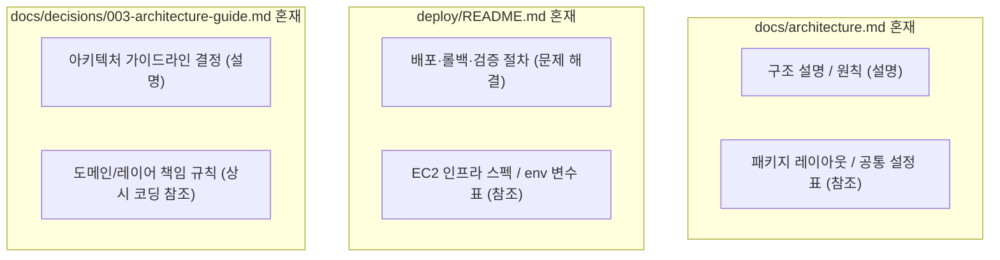

# TripFit Documentation Technical Writing Audit — 2026-09-03

이 문서는 저장소 내 126개 마크다운 문서(`docs/` 124개 및 `deploy/` 2개)를 대상으로 `.claude/rules/doc-writing.md` 테크니컬 라이팅 원칙을 전수 진단한 보고서다. 문서 유형 판정, 필수 섹션 누락, 유형 혼재, 용어 불일치(폐지된 `wave` 잔존), 문서 간 중복 및 drift 등 5개 축을 점검하여 심각도별(High / Medium / Low) 우선순위로 정리했다. 2단계에서는 보고서 작성만 수행하며, 실제 문서 분리 및 텍스트 수정은 사용자 승인 후 3단계에서 진행한다.

> **해소 이력 (2026-09-03):** 아래 "용어 불일치 — 폐지된 `wave` 잔존" 항목은 **전부 해소됐다.** 열린 이슈 39건을 대조해 `wave 1·2·3 → MVP 출시`, `wave 4 → 출시 이후`로 매핑했고, 문서·GitHub 이슈·파일명(`development-wave.md`→`release-milestones.md`, `harness-wave.md`→`harness-milestone.md`, `waves.md` 삭제)까지 정리했다. 지금 남은 `wave` 언급은 **폐지 사실 자체를 설명하는 문서**와 변경 이력뿐이다.
>
> **정정 이력 (2026-09-03):** 아래 발견 중 2건(`docs/architecture.md` CORS 불일치, `docs/product/release-milestones.md` 폐지 문서 잔존)은 재확인 결과 **사실이 아니었다.** 각 항목에 정정 주석을 달아뒀다.

## 1. 진단 요약 및 통계

전체 점검 대상 문서 중 개선이 필요한 항목을 심각도별로 분류했다.

| 심각도 | 건수 | 주요 해당 사유 |
|---|---|---|
| **High** (반드시 고칠 것) | 24건 | 유형 혼재(설명+참조, 문제해결+참조), H1 아래 개요 부재, 폐지된 `wave` 축을 현행 계획으로 다수 사용(5건 이상), 폐지된 기준 문서 잔존 |
| **Medium** (고치면 좋을 것) | 19건 | 문서 유형 불일치, ADR 필수 섹션(대안·트레이드오프) 누락, 작업 산출물(스펙) 필수 섹션(목표·검증 계획) 누락 |
| **Low** (참고 및 점진적 개선) | 37건 | 폐지된 `wave` 용어 소량 잔존(1~4건), 역사적 이력/감사 로그 내 레거시 용어(`개인 일정`) 잔존 |
| **정상/준수** | 46건 | 개요 보유, 템플릿 구조 준수, 폐지 용어 미사용 |

### 5대 점검 축별 핵심 발견 사항

1. **유형 혼재 (3건)**: `docs/architecture.md`(설명+참조), `deploy/README.md`(문제해결+참조), `docs/decisions/003-architecture-guide.md`(결정+가이드)에서 서로 다른 독자 목적의 내용이 한 파일에 섞여 문서가 비대해짐.
2. **개요 부재 (2건)**: 1단계에서 `docs/audits/` 17개 문서를 조치한 후, `docs/architecture.md`와 `docs/specs/cross-cutting/add-prometheus.md` 2개 문서에 H1 바로 아래 개요 문단이 여전히 없음.
3. **유형 불일치 (2건)**: `docs/how-it-works.md`는 규칙상 "학습"으로 매핑되어 있으나 실제로는 단계별 튜토리얼이 아닌 시스템 전체 "설명" 문서이며 학습 필수 섹션이 전무함. `docs/specs/auth/google-login-native-sdk-decision.md`는 결정(ADR) 문서이나 `specs/`에 위치함.
4. **용어 불일치 (폐지된 `wave` 잔존 67개 파일 488회)**: 2026-08-26 폐지된 `wave` 문자열이 67개 파일에서 총 488회 출현하며, 이 중 실제 도메인 개념 축으로 사용된 것이 423회, `release-milestones.md` 등 파일명 언급이 65회임. 특히 MVP 정의·로드맵·스펙 문서에서 현행 계획처럼 서술되어 독자에게 혼란을 유발함. 구 용어 `개인 일정`도 일부 잔존(SSOT는 `개별 일정`).
5. **문서 간 중복 및 Drift (5대 영역)**: CORS 허용 오리진 목록, 패키지 레이아웃 트리, 회원 상태 전이 규칙, 달력 조회 윈도우 허용 구간, EC2 인프라 포트 매핑이 여러 문서에 분산 기재되어 실제 코드와 어긋남.

---

## 2. 우선순위별 파일 진단 목록

### 2.1 반드시 고칠 것 (High Priority) — 24건

독자의 정보 탐색을 직접적으로 방해하거나, 두 가지 목적이 섞여 있거나, 폐지된 기준을 현행처럼 기술해 잘못된 결정을 유발할 위험이 있는 항목이다.

- [`docs/architecture.md`](../architecture.md) | **High** | [유형 혼재·개요 부재] 구조 원칙 설명(설명)과 패키지·설정 목록(참조)이 한 파일에 혼재되며, H1 바로 아래 개요 없이 `## Overview`로 시작함
- [`deploy/README.md`](../../deploy/README.md) | **High** | [유형 혼재] 배포 절차·트러블슈팅(문제 해결)과 EC2 서버 스펙·환경 변수 표(참조)가 한 파일에 혼재됨
- [`docs/decisions/003-architecture-guide.md`](../decisions/003-architecture-guide.md) | **High** | [유형 혼재·섹션 누락] ADR 결정(설명)과 상시 레이어 규칙(참조 가이드)이 혼재되어 있으며 대안·트레이드오프 섹션이 누락됨
- [`docs/specs/cross-cutting/add-prometheus.md`](../specs/cross-cutting/add-prometheus.md) | **High** | [개요 부재·섹션 누락] H1 바로 아래 개요 없이 `## 개요`로 시작하며, 스펙 필수 섹션인 목표·배경·검증 계획이 형식에 맞게 분리되지 않음
- [`docs/product/release-milestones.md`](../product/release-milestones.md) | **High** | [폐지 문서 잔존] 2026-08-26 폐지된 구 도메인 축 기준 문서가 단독 파일로 잔존하여 `release-milestones.md`와 중복·충돌을 유발함 (폐지 안내 명시 또는 통폐합 필요)
   - **[2026-09-03 정정]** 이 발견도 **오류다.** `release-milestones.md`는 이미 H1 아래에 "폐지됨 (2026-08-26)" 인용구와 `release-milestones.md` 안내가 들어간 **스텁 문서**다. 하위 링크 호환을 위해 의도적으로 남긴 것이므로 조치가 필요 없다.
- [`docs/product/mvp.md`](../product/mvp.md) | **High** | [용어 불일치] 폐지된 `wave` 구분을 현행 릴리즈 계획 축으로 다수 사용(7건)하며, Milestone(`MVP 출시`/`출시 이후`)과 `priority: must/could` 체계로 전환 필요
- [`docs/specs/README.md`](../specs/README.md) | **High** | [용어 불일치] 스펙 인덱스 문서에서 스펙들을 폐지된 `Wave 1~4` 기준으로 분류 및 서술(22건)하고 있어 Milestone 분류 체계와 불일치
- [`docs/specs/auth/auth-social-login.md`](../specs/auth/auth-social-login.md) | **High** | [용어 불일치·Drift] 본문 내 `wave` 용어가 34회 잔존하며, `common/` 패키지 트리가 과거 상태로 적혀 있어 실제 코드 및 아키텍처 문서와 drift 발생
- [`docs/specs/auth/auth-token-rotation.md`](../specs/auth/auth-token-rotation.md) | **High** | [용어 불일치] 폐지된 `wave 4` 일정 축을 현행 계획처럼 다수 기술(19건)함
- [`docs/decisions/006-profile-image-url-storage.md`](../decisions/006-profile-image-url-storage.md) | **High** | [용어 불일치] 본문 및 섹션 제목에 `wave 1`, `wave 2` 계획 축이 다수 잔존(18건)함
- [`docs/product/design/figma-wireframe-v1.md`](../product/design/figma-wireframe-v1.md) | **High** | [용어 불일치] UI 화면 정의 및 로드맵에서 폐지된 `wave` 용어를 14회 잔존 기술함
- [`docs/decisions/004-auth-token-rotation.md`](../decisions/004-auth-token-rotation.md) | **High** | [용어 불일치] 섹션 제목(`## wave 1 → wave 4 관계`) 및 본문에 폐지된 `wave` 용어 13건 잔존
- [`docs/specs/trip/trip-recommendation.md`](../specs/trip/trip-recommendation.md) | **High** | [용어 불일치] 본문 및 설계 요구사항에 폐지된 `wave` 용어 10건 잔존
- [`docs/architecture/erd.md`](../architecture/erd.md) | **High** | [용어 불일치·참조 누락] 엔티티 정의 설명란에 `wave 1`, `wave 4` 표기가 8건 잔존하며, 참조 문서 필수 섹션(언제 보는가, 관련 문서)이 누락됨
- [`docs/specs/trip/schedule-participation-onboarding.md`](../specs/trip/schedule-participation-onboarding.md) | **High** | [섹션 누락·용어 불일치] 스펙 필수 섹션인 검증 계획이 누락되었으며, 폐지된 `wave` 용어 8건 잔존
- [`docs/specs/trip/trip-room-api.md`](../specs/trip/trip-room-api.md) | **High** | [용어 불일치] 본문 내 폐지된 `wave` 용어 8건 잔존
- [`docs/decisions/005-auth-social-verifier-strategy.md`](../decisions/005-auth-social-verifier-strategy.md) | **High** | [용어 불일치] ADR 본문에 폐지된 `wave` 용어 7건 잔존
- [`docs/specs/user/user-profile-image-s3-mirror.md`](../specs/user/user-profile-image-s3-mirror.md) | **High** | [섹션 누락·용어 불일치] 스펙 필수 섹션인 검증 계획이 누락되었으며, 폐지된 `wave` 용어 7건 잔존
- [`docs/specs/notification/notification.md`](../specs/notification/notification.md) | **High** | [용어 불일치] 본문 및 DTO 설계 절에 폐지된 `wave` 용어 6건 잔존
- [`docs/specs/user/user-account-withdrawal.md`](../specs/user/user-account-withdrawal.md) | **High** | [용어 불일치] 본문 내 폐지된 `wave` 용어 6건 잔존
- [`docs/specs/user/user-my-page.md`](../specs/user/user-my-page.md) | **High** | [용어 불일치] 본문 내 폐지된 `wave` 용어 6건 잔존
- [`docs/harness-engineering.md`](../harness-engineering.md) | **High** | [용어 불일치] 하네스 설계 설명 본문에 폐지된 `wave` 용어 5건 잔존
- [`docs/specs/user/google-calendar-client-id-separation.md`](../specs/user/google-calendar-client-id-separation.md) | **High** | [섹션 누락·용어 불일치] 스펙 검증 계획 누락 및 폐지된 `wave` 용어 5건 잔존
- [`docs/specs/user/google-calendar-oauth.md`](../specs/user/google-calendar-oauth.md) | **High** | [섹션 누락·용어 불일치] 스펙 검증 계획 누락 및 폐지된 `wave` 용어 5건 잔존

---

### 2.2 고치면 좋을 것 (Medium Priority) — 19건

문서의 형식적 완결성을 위해 보완이 필요한 항목으로, 템플릿 필수 섹션 누락 또는 유형 재정의가 필요한 문서들이다.

- [`docs/how-it-works.md`](../how-it-works.md) | **Medium** | [유형 불일치] `doc-writing.md` 표에는 '학습'으로 매핑되어 있으나 실제 내용은 온보딩 튜토리얼이 아닌 '시스템 동작 설명'이며, 학습 필수 섹션(사전 준비, 단계, 확인, 다음 읽을 것)이 전무함 (설명 문서로 유형 재매핑 권장)
- [`docs/specs/auth/google-login-native-sdk-decision.md`](../specs/auth/google-login-native-sdk-decision.md) | **Medium** | [유형/위치 불일치] 아키텍처 결정(ADR) 문서이나 `docs/specs/auth/`에 위치하며, 스펙 템플릿 필수 절인 검증 계획이 누락됨 (`docs/decisions/` 이동 또는 스펙 형식 전환 권장)
- [`docs/decisions/002-domain-split-vercel-api.md`](../decisions/002-domain-split-vercel-api.md) | **Medium** | [ADR 섹션 누락] ADR 템플릿 필수 섹션인 `맥락`, `고려한 대안`, `트레이드오프` 섹션이 누락되고 `## 결정`, `## 이유`로만 구성됨
- [`docs/decisions/007-user-profile-onboarding.md`](../decisions/007-user-profile-onboarding.md) | **Medium** | [ADR 섹션 누락] ADR 템플릿 필수 섹션인 `트레이드오프` 섹션 누락 및 폐지된 `wave` 용어 2건 잔존
- [`docs/specs/cross-cutting/swagger-openapi-docs.md`](../specs/cross-cutting/swagger-openapi-docs.md) | **Medium** | [스펙 섹션 누락] 스펙 템플릿 필수 섹션인 `목표` 및 `검증 계획` 누락
- [`docs/specs/trip/package-structure-refactor.md`](../specs/trip/package-structure-refactor.md) | **Medium** | [스펙 섹션 누락] 스펙 템플릿 필수 섹션인 `목표` 및 `검증 계획` 누락
- [`docs/specs/trip/trip-recommendation-scoring-source.md`](../specs/trip/trip-recommendation-scoring-source.md) | **Medium** | [스펙 섹션 누락] 스펙 필수 섹션인 `목표`, `배경`, `검증 계획` 누락 (계산 로직 설명 위주로 구성)
- [`docs/specs/user-schedule/schedule-state-response.md`](../specs/user-schedule/schedule-state-response.md) | **Medium** | [스펙 섹션 누락] 스펙 필수 섹션인 `목표`, `배경`, `검증 계획` 누락
- [`docs/specs/trip/kakao-invite-share.md`](../specs/trip/kakao-invite-share.md) | **Medium** | [스펙 섹션 누락] 스펙 템플릿 필수 섹션인 `검증 계획` 누락
- [`docs/specs/trip/trip-calendar-window-pre-join.md`](../specs/trip/trip-calendar-window-pre-join.md) | **Medium** | [스펙 섹션 누락] 스펙 템플릿 필수 섹션인 `검증 계획` 누락
- [`docs/specs/trip/trip-home-schedulers.md`](../specs/trip/trip-home-schedulers.md) | **Medium** | [스펙 섹션 누락] 스펙 템플릿 필수 섹션인 `검증 계획` 누락
- [`docs/specs/trip/trip-join-schedule-gate.md`](../specs/trip/trip-join-schedule-gate.md) | **Medium** | [스펙 섹션 누락] 스펙 템플릿 필수 섹션인 `검증 계획` 누락
- [`docs/specs/trip/trip-last-activity-at.md`](../specs/trip/trip-last-activity-at.md) | **Medium** | [스펙 섹션 누락] 스펙 템플릿 필수 섹션인 `검증 계획` 누락
- [`docs/specs/trip/trip-member-remove.md`](../specs/trip/trip-member-remove.md) | **Medium** | [스펙 섹션 누락] 스펙 템플릿 필수 섹션인 `배경`, `검증 계획` 누락
- [`docs/specs/trip/trip-schedule-calendar-window.md`](../specs/trip/trip-schedule-calendar-window.md) | **Medium** | [스펙 섹션 누락] 스펙 템플릿 필수 섹션인 `배경`, `검증 계획` 누락
- [`docs/specs/trip/trip-schedule-snapshot.md`](../specs/trip/trip-schedule-snapshot.md) | **Medium** | [스펙 섹션 누락] 스펙 템플릿 필수 섹션인 `배경`, `검증 계획` 누락
- [`docs/specs/trip/trip-thumbnail-image.md`](../specs/trip/trip-thumbnail-image.md) | **Medium** | [스펙 섹션 누락] 스펙 템플릿 필수 섹션인 `검증 계획` 누락
- [`docs/specs/user-schedule/schedule-unified.md`](../specs/user-schedule/schedule-unified.md) | **Medium** | [스펙 섹션 누락] 스펙 템플릿 필수 섹션인 `배경`, `검증 계획` 누락
- [`docs/specs/user/user-onboarding.md`](../specs/user/user-onboarding.md) | **Medium** | [스펙 섹션 누락] 스펙 템플릿 필수 섹션인 `배경` 누락 및 폐지된 `wave` 용어 4건 잔존

---

### 2.3 참고 및 점진적 개선 (Low Priority) — 37건

과거 변경 이력, 완료된 감사 보고서, 또는 경미한 용어 잔존(1~4건)으로 인해 당장 기능 개발이나 독해에 지장이 크지 않은 항목이다.

- [`docs/README.md`](../README.md) | **Low** | 폐지된 'wave' 용어 잔존 (3건, SSOT 설명란 정리 필요)
- [`docs/product/glossary.md`](../product/glossary.md) | **Low** | 폐지된 'wave' 및 구 용어 설명 항목(폐지 사유 안내 목적이나 인덱스 정비 권장)
- [`docs/product/platform.md`](../product/platform.md) | **Low** | 폐지된 'wave' 용어 잔존 (4건)
- [`docs/product/prd.md`](../product/prd.md) | **Low** | 폐지된 'wave' 용어 잔존 (2건)
- [`docs/product/business-rules/notification.md`](../product/business-rules/notification.md) | **Low** | 폐지된 'wave' 용어 잔존 (4건)
- [`docs/product/business-rules/trip.md`](../product/business-rules/trip.md) | **Low** | 폐지된 'wave' 용어 잔존 (2건)
- [`docs/product/business-rules/user.md`](../product/business-rules/user.md) | **Low** | 폐지된 'wave' 용어 잔존 (1건)
- [`docs/product/flows/README.md`](../product/flows/README.md) | **Low** | 폐지된 'wave' 용어 잔존 (1건)
- [`docs/product/flows/trip-confirm.md`](../product/flows/trip-confirm.md) | **Low** | 폐지된 'wave' 용어 잔존 (1건)
- [`docs/decisions/001-auth-mobile-token-verification.md`](../decisions/001-auth-mobile-token-verification.md) | **Low** | 폐지된 'wave' 용어 잔존 (4건)
- [`docs/decisions/README.md`](../decisions/README.md) | **Low** | 폐지된 'wave' 용어 잔존 (1건)
- [`docs/harness/layer1-human-gate.md`](../harness/layer1-human-gate.md) | **Low** | 폐지된 'wave' 용어 잔존 (2건)
- [`docs/specs/user-schedule/pre-schedule-entry-flow.md`](../specs/user-schedule/pre-schedule-entry-flow.md) | **Low** | 본문 내 레거시 용어 '개인 일정' 다수 잔존 (4건, '개별 일정'으로 통일 필요)
- [`docs/specs/trip/trip-join-capacity-hold.md`](../specs/trip/trip-join-capacity-hold.md) | **Low** | 폐지된 'wave' 용어 잔존 (4건)
- [`docs/specs/trip/trip-member-leave.md`](../specs/trip/trip-member-leave.md) | **Low** | 폐지된 'wave' 용어 잔존 (3건)
- [`docs/specs/trip/trip-recommendation-algorithm.md`](../specs/trip/trip-recommendation-algorithm.md) | **Low** | 폐지된 'wave' 용어 잔존 (4건)
- [`docs/specs/user-schedule/schedule-calendar-resolve.md`](../specs/user-schedule/schedule-calendar-resolve.md) | **Low** | 폐지된 'wave' 용어 잔존 (4건)
- [`docs/specs/user-schedule/schedule-holiday-list-api.md`](../specs/user-schedule/schedule-holiday-list-api.md) | **Low** | 폐지된 'wave' 용어 잔존 (1건)
- [`docs/specs/user-schedule/schedule-holiday-rest.md`](../specs/user-schedule/schedule-holiday-rest.md) | **Low** | 폐지된 'wave' 용어 잔존 (4건)
- [`docs/specs/auth/auth-apple-server-notifications.md`](../specs/auth/auth-apple-server-notifications.md) | **Low** | 폐지된 'wave' 용어 잔존 (2건)
- [`docs/specs/auth/auth-error-code-granularity.md`](../specs/auth/auth-error-code-granularity.md) | **Low** | 폐지된 'wave' 용어 잔존 (1건)
- [`docs/specs/auth/auth-refresh-redis-cookie.md`](../specs/auth/auth-refresh-redis-cookie.md) | **Low** | 폐지된 'wave' 용어 잔존 (2건)
- [`docs/specs/auth/dev-mock-login.md`](../specs/auth/dev-mock-login.md) | **Low** | 폐지된 'wave' 용어 잔존 (1건)
- [`docs/specs/auth/google-login-revoke.md`](../specs/auth/google-login-revoke.md) | **Low** | 폐지된 'wave' 용어 잔존 (3건)
- [`docs/specs/cross-cutting/api-contract-diff-ci.md`](../specs/cross-cutting/api-contract-diff-ci.md) | **Low** | 폐지된 'wave' 용어 잔존 (1건)
- [`docs/specs/cross-cutting/harness-track-gate-restructure.md`](../specs/cross-cutting/harness-track-gate-restructure.md) | **Low** | 폐지된 'wave' 용어 잔존 (1건)
- [`docs/specs/cross-cutting/openapi-response-schema-generics.md`](../specs/cross-cutting/openapi-response-schema-generics.md) | **Low** | 폐지된 'wave' 용어 잔존 (1건)
- [`docs/specs/cross-cutting/social-integration-structured-logging.md`](../specs/cross-cutting/social-integration-structured-logging.md) | **Low** | 폐지된 'wave' 용어 잔존 (1건)
- [`docs/specs/cross-cutting/uuid-primary-key.md`](../specs/cross-cutting/uuid-primary-key.md) | **Low** | 폐지된 'wave' 용어 잔존 (1건)
- [`docs/audits/auth/audit.md`](auth/audit.md) | **Low** | 폐지된 'wave' 용어 잔존 (3건, 과거 감사 기록)
- [`docs/audits/auth/audit-round2.md`](auth/audit-round2.md) | **Low** | 폐지된 'wave' 용어 잔존 (2건, 과거 감사 기록)
- [`docs/audits/cross-cutting/refactor-log.md`](cross-cutting/refactor-log.md) | **Low** | 폐지된 'wave' 용어 잔존 (1건, 과거 리팩토링 로그)
- [`docs/audits/user-schedule/audit-round2.md`](user-schedule/audit-round2.md) | **Low** | 폐지된 'wave' 용어 잔존 (1건, 과거 감사 기록)
- [`docs/audits/trip/audit-round3.md`](trip/audit-round3.md) | **Low** | 레거시 용어 '개인 일정' 잔존 (1건, 과거 감사 기록)
- [`docs/audits/trip/refactor-log.md`](trip/refactor-log.md) | **Low** | 레거시 용어 '개인 일정' 잔존 (1건, 과거 반영 이력)
- [`docs/audits/user-schedule/refactor-log.md`](user-schedule/refactor-log.md) | **Low** | 레거시 용어 '개인 일정' 잔존 (1건, 과거 반영 이력)
- [`docs/product/release-milestones.md`](../product/release-milestones.md) | **Low** | 파일명에 `wave`가 포함되어 있고 본문에서 폐지 사실을 설명하나, 장기적으로 `milestone-priority.md` 등으로 파일명 개명 권장

---

## 3. 5대 핵심 점검 축 상세 분석

### 3.1 문서 유형 판정 및 불일치 상세

`.claude/rules/doc-writing.md`의 "이 저장소 문서의 유형 매핑" 표와 실제 독자 목적이 충돌하는 사례다.

| 경로 | 규칙 표 유형 | 실제 읽히는 유형 | 불일치 사유 및 대안 |
|---|---|---|---|
| `docs/how-it-works.md` | 학습 | **설명** | 신규 사용자가 따라 할 수 있는 튜토리얼 단계가 없으며, 시스템이 "현재 어떻게 돌아가는지"를 넓게 조망하는 아키텍처 설명서임. `doc-writing.md` 매핑을 '설명'으로 갱신하고, 진짜 학습 문서는 `docs/onboarding/` 등의 별도 실습 가이드로 신설 권장 |
| `docs/specs/auth/google-login-native-sdk-decision.md` | 작업 산출물(스펙) | **설명 (ADR)** | 구글 로그인 SDK 채택에 대한 배경·결정·대안 비교 문서이며 스펙 산출물이 아님. `docs/decisions/` 하위 ADR로 편입 권장 |
| `docs/product/release-milestones.md` | 참조 | ~~폐기 대상~~ → **조치 불필요** | **[2026-09-03 정정]** 이미 H1 아래 "폐지됨 (2026-08-26)" 인용구와 `release-milestones.md` 안내가 있는 **스텁 문서**다. 하위 링크 호환용으로 의도적으로 남긴 것 |

### 3.2 유형 혼재 문서 분리 대상 제안 (3단계 선행 검토)

한 파일에 두 가지 독자 목적이 섞여 있어 분리가 시급한 문서 목록이다.

1. **`docs/architecture.md` 분리 제안**:
   - **`docs/architecture.md` (설명 유형 유지)**: TripFit 서버 전체 시스템 구조, 핵심 레이어 흐름(Controller → Service → Repository), 설계 원칙
   - **`docs/architecture/package-layout.md` (참조 유형 신규 분리)**: 패키지별 상세 트리, 도메인별 소유 클래스 목록, 공통 설정 클래스 표
2. **`deploy/README.md` 분리 제안**:
   - **`deploy/README.md` (문제 해결 유형 유지)**: 배포 순서, 무중단 배포 검증 스크립트 실행법, 장애 발생 시 롤백 절차, 자주 묻는 배포 트러블슈팅
   - **`deploy/environment-reference.md` (참조 유형 신규 분리)**: EC2 인스턴스 역할/포트 구성표, Docker 서비스 매핑, 필수 환경 변수(`application.yml` 연동 키) 목록
3. **`docs/decisions/003-architecture-guide.md` 정비 제안**:
   - ADR 본래 형식(`맥락`, `결정`, `고려한 대안`, `트레이드오프`)으로 정리하고, 상시 코딩 가이드 부분은 `.claude/rules/` 또는 `docs/architecture/` 참조로 일원화

### 3.3 폐지된 `wave` 및 레거시 도메인 용어 잔존 분석

- **폐지된 `wave` 잔존 빈도 상위 10개 파일**:
  1. `docs/specs/auth/auth-social-login.md` (34회)
  2. `docs/specs/README.md` (22회)
  3. `docs/specs/auth/auth-token-rotation.md` (19회)
  4. `docs/decisions/006-profile-image-url-storage.md` (18회)
  5. `docs/product/design/figma-wireframe-v1.md` (14회)
  6. `docs/decisions/004-auth-token-rotation.md` (13회)
  7. `docs/product/release-milestones.md` (13회)
  8. `docs/specs/trip/trip-recommendation.md` (10회)
  9. `docs/architecture/erd.md` (8회)
  10. `docs/specs/trip/schedule-participation-onboarding.md` (8회)

- **도메인 용어 대조 (`docs/product/glossary.md` SSOT)**:
  - `개인 일정` (구 용어) 잔존 → `개별 일정` (`personal_schedule`)으로 수정 필요. (`pre-schedule-entry-flow.md`, `how-it-works.md` 등)
  - 단, 과거 감사 기록(`audit-round3.md`, `refactor-log.md`)의 인용 문구는 역사적 사실 보존을 위해 원본 유지.

### 3.4 문서 간 중복 및 Drift 위험 지점

동일한 값이 여러 문서에 수기 작성되어 소스 코드와 문서 간, 혹은 문서 상호 간 어긋나 있는 지점이다.

1. ~~**CORS 허용 오리진 목록**~~ — **[2026-09-03 정정] 이 발견은 오류다.**
   - `git show HEAD:docs/architecture.md`로 확인한 결과 그 파일에는 **원래부터 CORS 오리진 목록이 없었다.**
   - 실제 코드(`SecurityConfig`)는 `https://tripfit.online` · `https://www.tripfit.online` · `https://api.tripfit.online` 3개를 허용하며, `decisions/002`와 충돌하지 않는다.
   - 과거 `WebConfig`와 `SecurityConfig` 사이에 있었던 drift(`audits/cross-cutting/audit.md`에 기록된 **코드** 감사 항목)와 혼동한 것으로 보인다. 조치 불필요.
2. **패키지 레이아웃 트리**:
   - `docs/architecture.md`, `docs/how-it-works.md`, `docs/specs/auth/auth-social-login.md`에 각기 다른 시점의 트리가 복사되어 있음 (`WebConfig` 삭제, `OpenApiConfig` 이동 등이 일부 문서에만 반영됨).
   - 조치 방향: `docs/architecture/package-layout.md` 하나로 SSOT 통합하고 다른 문서는 링크 참조
3. **회원 상태 전이 규칙 (`SCHEDULE_PENDING` → `ACTIVE`)**:
   - `docs/product/glossary.md`, `docs/specs/trip/trip-join-schedule-gate.md`, `docs/product/flows/trip-create-join-guide.md`에 각각 풀어서 중복 기술됨.
4. **달력 허용 구간 (`today` ~ `today+2년-1일`)**:
   - `docs/product/glossary.md`, `docs/specs/user-schedule/schedule-calendar-resolve.md`, `docs/product/business-rules/user.md`에 분산 기재.
5. **EC2 서버 4대 역할 및 포트 매핑**:
   - `deploy/README.md`, `docs/how-it-works.md`, `docs/decisions/002-domain-split-vercel-api.md`에 분산 기재.

### 3.5 필수 섹션 및 개요 누락 현황

1. **H1 바로 아래 개요 누락**:
   - `docs/architecture.md`: H1 다음 줄이 곧바로 `## Overview`
   - `docs/specs/cross-cutting/add-prometheus.md`: H1 다음 줄이 곧바로 `## 개요`
2. **스펙 문서 검증 계획 누락 (21개)**:
   - `docs/specs/` 하위 스펙 중 21개 문서가 구현 내용 위주로 작성되어 `## 검증 계획` 절이 없음. (`audit-template.md` 및 `spec-template.md` 기준 미충족)
3. **ADR 문서 트레이드오프 누락 (2개)**:
   - `002-domain-split-vercel-api.md`: 결정/이유 위주, 대안/트레이드오프 부재
   - `007-user-profile-onboarding.md`: 트레이드오프 부재

---

## 4. 3단계 실행 권고안 및 사용자 승인 필요 사항

3단계 착수 전 다음 사항에 대한 사용자 결정이 필요하다.

1. **유형 혼재 문서 분리 승인**:
   - `docs/architecture.md` → 구조 설명(`architecture.md`) + 패키지 참조(`docs/architecture/package-layout.md`)로 분리
   - `deploy/README.md` → 배포 절차(`deploy/README.md`) + 환경 변수/인프라 참조(`deploy/environment-reference.md`)로 분리
2. ~~**폐지된 `wave` 기준 문서 처리**~~ — **[2026-09-03 정정] 조치 불필요.** `release-milestones.md`는 이미 폐지 마커와 안내가 들어간 스텁이다.
3. **유형/위치 불일치 문서 이동**:
   - `docs/specs/auth/google-login-native-sdk-decision.md` → `docs/decisions/012-google-login-native-sdk.md`로 이동 및 ADR 형식 정비
4. **H1 개요 즉시 추가**:
   - `docs/architecture.md`, `docs/specs/cross-cutting/add-prometheus.md` 2개 파일에 H1 개요 2~3문장 추가
5. **`how-it-works.md` 유형 매핑 공식 갱신**:
   - `.claude/rules/doc-writing.md` 표에서 `how-it-works.md`의 유형을 '학습'에서 '설명'으로 갱신
