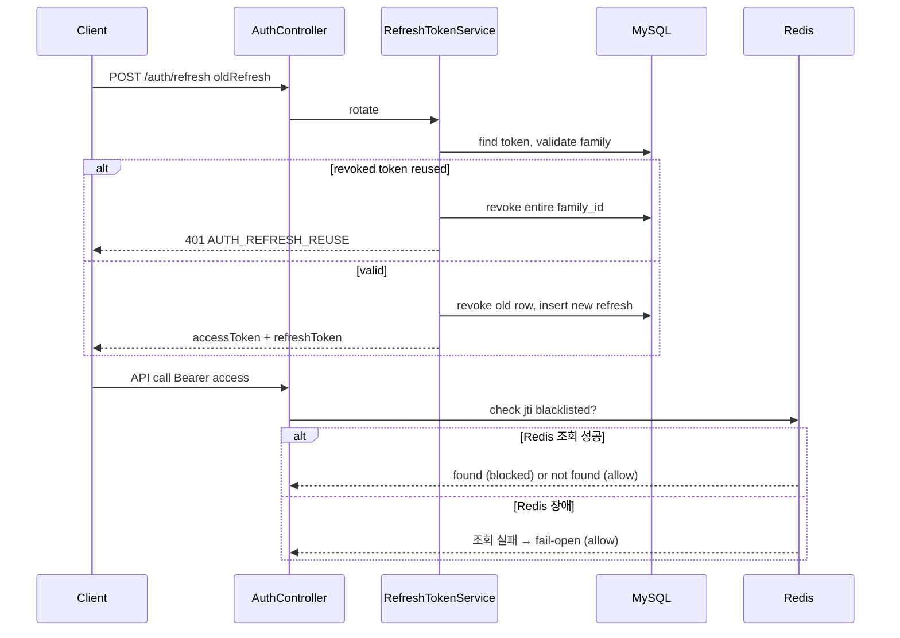

# 인증 토큰 Rotation — RTR + Redis

> wave: 4  
> 선행: wave 1 [`auth-social-login.md`](auth-social-login.md)  
> 결정: [`docs/decisions/004-auth-token-rotation.md`](../../decisions/004-auth-token-rotation.md) — **RTR 확정**, **Redis Blacklist 확정**(2026-08-08). 인프라: [`010-redis-infra.md`](../../decisions/010-redis-infra.md)(EC2 D)  
> 상태: Approved (2026-08-10) — **2026-09-15 이 문서의 핵심 전제 2가지(refresh는 MySQL SSOT, access는 Redis Blacklist)가 [`auth-refresh-redis-cookie.md`](auth-refresh-redis-cookie.md)로 뒤집혔다.** RTR(rotation·reuse detection) 자체의 시맨틱은 그대로 유지되고 저장소만 MySQL→Redis로 바뀌었으니, 이 문서는 RTR 개념 설명용 이력으로 남기고 실제 저장·전달 계약은 새 문서를 SSOT로 본다.

## 목표

wave 1 이후 아래를 도입한다.

1. **Refresh Token Rotation (RTR)** — refresh 시 token 교체 + reuse detection
2. **Redis Blacklist** — access JWT logout/탈퇴 시 즉시 무효화

## 배경

- wave 1: DB refresh + stateless access JWT (`jti` 포함)
- 확정된 후속: RTR + Redis ([`004`](../../decisions/004-auth-token-rotation.md))
- login API shape·단일 `POST /auth/login`은 **변경 없음**

### 관련 문서

| 문서 | 내용 |
|------|------|
| `auth-social-login.md` | wave 1 baseline |
| `004-auth-token-rotation.md` | RTR·Redis 결정 (Blacklist 확정) |
| `010-redis-infra.md` | Redis 인프라 배치 (EC2 D) |
| `architecture/erd.md` | `refresh_token` + `family_id` |

## 아키텍처 개요



## 요구사항

### Must Have (wave 4)

- [x] **RTR:** `POST /auth/refresh` 성공 시 새 `refreshToken` 발급, 기존 refresh 즉시 revoke — `RefreshTokenService.rotate()`
- [x] **Reuse detection:** revoke된 refresh 재사용 → `AUTH_REFRESH_REUSE` + 해당 `family_id` 전체 revoke
- [x] **Redis 연동:** Spring Data Redis(Lettuce) — `spring.data.redis.*`(env `REDIS_HOST`/`REDIS_PORT`/`REDIS_PASSWORD`), 짧은 connect/command timeout(300ms)으로 fail-open이 실제로 빠르게 동작하도록 구성
- [x] **Access JWT `jti` Blacklist 검증:** `TokenRevocationChecker` 구현체를 `NoOpTokenRevocationChecker`(삭제) → `RedisTokenRevocationChecker`로 교체
- [x] logout·탈퇴 시 refresh revoke + access `jti`를 `SET auth:bl:{jti} 1 EX {remaining_ttl}`로 블랙리스트 등록 — 로그아웃은 `LogoutRequest.accessToken`(선택), 탈퇴는 `JwtAuthentication`이 들고 있는 현재 요청의 jti·만료시각 사용
- [x] **Redis 장애 시 fail-open:** 조회·등록 모두 `DataAccessException` catch 후 통과/스킵 (`decisions/004`·`010` 근거) — Testcontainers로 정상 케이스, 존재하지 않는 포트로 장애 케이스 모두 검증
- [x] `refresh_token` 인덱스 추가: `INDEX(family_id)`, `INDEX(user_id, revoked_at)`
- [x] `./gradlew test` — RTR·reuse·Redis(Testcontainers 실컨테이너 + 장애 시뮬레이션)·fail-open 테스트 전부 통과(452개 전체)

### Redis access 전략 — Blacklist (2026-08-08 확정, `decisions/004` 참고)

- 평소: Redis 미조회 또는 jti absent = 유효
- logout·탈퇴·강제 revoke: `SET auth:bl:{jti} 1 EX {remaining_ttl}`
- JwtFilter: jti 존재(블랙리스트) 시 401, 조회 실패(Redis 장애) 시 통과(fail-open)
- Whitelist는 미채택(범위 밖 절 참고) — 이유: EC2 D가 이중화 없는 단일 인스턴스라, Whitelist의 fail-closed 특성(Redis 장애 = 전체 로그인 마비)이 이 인프라 단계에 안 맞음

### `[미정]` — Reuse detection과 access token 블랙리스트 연결 여부 (Deferred — 이번 라운드 Must Have 아님)

refresh reuse가 탐지돼 `family_id` 전체가 revoke될 때, 그 family로 발급됐던 access token도 같이 블랙리스트에 올릴지는 아직 미정이다. **2026-08-08 — 이번 `#4` 라운드에서는 다루지 않기로 결정.** 별도 이슈·스펙 분리 없이 이 스펙의 미정 항목으로만 남겨두고, `#4` Must Have에는 포함하지 않는다.

- 지금 `AccessTokenClaims`엔 `jti`만 있고 `family_id`가 없어, "이 family로 발급된 access token이 뭔지" 서버가 추적할 방법이 없음
- 넣으려면 JWT claim에 `family_id` 추가 필요(API 응답 계약엔 영향 없음 — 내부 클레임)
- 안 넣으면: refresh 탈취가 걸려 family가 revoke돼도, 이미 나가 있는 access token은 자기 만료 시각(최대 2h)까지 계속 유효 — reuse detection의 방어 범위가 "새 토큰 발급 차단"까지만이고 "이미 발급된 것 회수"는 못 함
- **왜 지금 안 막아도 괜찮은가:** RTR만으로도 wave 1 대비 노출 창이 "탈취 후 최대 30일"에서 "탈취한 refresh가 재사용되는 순간까지 + 그때 이미 나가 있던 access token 잔여 수명(최대 2h)"으로 크게 줄어든다 — 이 마지막 구멍은 추가 개선이지 이번 라운드의 필수 방어선은 아님
- 재상정 조건: 이후 라운드에서 다시 검토하거나, 실제 reuse 탐지 사례가 쌓여 이 잔여 노출이 문제로 관측되면 Must Have로 승격 검토

### Nice to Have

- [ ] user당 active refresh token 상한 (예: 5 devices)
- [ ] refresh token `device_label` / `last_used_at`

### Out of Scope

- refresh token Redis 저장
- OAuth provider token Redis cache
- 분산 refresh lock (DB transaction으로 시작)
- **Whitelist 전략** — Blacklist로 확정(`decisions/004`), 단일 인스턴스 Redis(EC2 D)에서 fail-closed 리스크가 커 미채택

## API 변경

### `POST /api/v1/auth/refresh` — wave 4 응답 확장

wave 1:

```json
{ "accessToken": "...", "expiresIn": 7200 }
```

**wave 4 (additive):**

```json
{
  "accessToken": "<jwt>",
  "refreshToken": "<new opaque token>",
  "expiresIn": 7200
}
```

- `login` 응답: **변경 없음**
- 클라이언트: wave 4 배포 시 refresh 응답의 `refreshToken` **필수 저장**

### 에러 추가

| HTTP | code | 상황 |
|------|------|------|
| 401 | `AUTH_REFRESH_REUSE` | 폐기된 refresh 재사용 — family 전체 revoke됨, 재로그인 필요 |

## 데이터 모델

### `refresh_token` — wave 4 컬럼 (wave 1에서 선반영 권장)

| 컬럼 | 타입 | Nullable | 설명 |
|------|------|----------|------|
| family_id | char(36) | N | UUID — 동일 로그인 체인. login 시 신규, rotation 시 유지 |
| revoked_at | datetime(6) | Y | revoke 시각. wave 4 rotation 시 set. wave 1 logout은 delete 가능 |

wave 1: login마다 새 `family_id`, `revoked_at` null. wave 4: rotation 시 old row `revoked_at` set (또는 soft revoke 후 delete 정책 — 구현 시 하나로 통일).

**인덱스 추가:** `INDEX (family_id)`, `INDEX (user_id, revoked_at)`

### Redis 키

| 키 패턴 | 용도 | TTL |
|---------|------|-----|
| `auth:bl:{jti}` | Blacklist — logout·탈퇴 시 등록 | access 남은 수명 |

## 패키지 / 코드 (예정)

```
auth/
├── service/
│   ├── RefreshTokenService.java     # rotation, family revoke
│   └── security/
│       ├── TokenRevocationChecker.java
│       ├── NoOpTokenRevocationChecker.java
│       └── RedisTokenRevocationChecker.java   # wave 4
├── config/
│   └── RedisConfig.java             # wave 4
└── repository/
    ├── RefreshToken.java
    └── RefreshTokenRepository.java
```

패키징 가이드: `docs/decisions/003-architecture-guide.md`

## 환경 변수 (wave 4 추가)

| 변수 | 용도 |
|------|------|
| `REDIS_HOST` | Redis host (EC2 D 사설 IP) |
| `REDIS_PORT` | 기본 6379 |
| `REDIS_PASSWORD` | Redis `requirepass` |

`deploy/app/.env.example` wave 4 PR에서 갱신. `deploy/redis/` compose·EC2 D 배치는 [`010-redis-infra.md`](../../decisions/010-redis-infra.md) 참고.

## 검증 시나리오

### RTR

- [x] refresh 성공 → 새 refreshToken, 구 token으로 재refresh → 401(`RefreshTokenServiceTest.rotate_expiredToken_*`류 + reuse 케이스)
- [x] 구 token reuse → `AUTH_REFRESH_REUSE`, family 전체 revoke — `RefreshTokenServiceTest.rotate_alreadyRevokedToken_revokesWholeFamilyAndThrowsReuse`
- [x] login → refresh → refresh → chain 유효 — `rotate_validToken_revokesOldAndIssuesNewInSameFamily`(같은 family_id 유지 확인)

### Redis (Blacklist)

- [x] logout → access JWT 즉시 401 대상(jti) 블랙리스트 등록 — `AuthServiceTest.logout_withAccessToken_alsoBlacklistsJti`, `RedisTokenRevocationCheckerTest.revoke_thenIsRevoked_returnsTrue`
- [x] access 만료 후 Redis key 자동 소멸(TTL) — `RedisTokenRevocationCheckerTest.revoke_setsTtlMatchingRemainingLifetime`
- [x] Redis 조회 실패(장애 시뮬레이션) → fail-open으로 통과, 로그인 자체는 정상 동작 — `RedisTokenRevocationCheckerTest.unreachableRedis_isRevoked_failsOpenInsteadOfThrowing`(잘못된 포트로 실제 연결 실패 재현)

## 완료 기준

- [x] decisions `004` Redis 전략 `[미정]` → Blacklist 확정 amend (2026-08-08)
- [x] Redis 인프라 배치 결정 → [`010-redis-infra.md`](../../decisions/010-redis-infra.md) (2026-08-08)
- [x] "Reuse detection ↔ access token 블랙리스트 연결" `[미정]` — 이번 라운드 Deferred로 확정, Must Have 제외 (2026-08-08)
- [x] `erd.md` wave 4 컬럼·Redis 운영 메모 동기화 (2026-08-10)
- [x] `./gradlew test` 전체 통과 (452개, 0 실패) (2026-08-10)
- [x] EC2 D 프로비저닝 완료 (2026-08-10) — `TP-redis`(`i-06fb8540484834192`, private IP `172.31.38.246`). App(sg-app)에서만 접근 가능·외부 차단 실측 확인, GitHub Secrets(`REDIS_HOST`/`REDIS_PORT`/`REDIS_PASSWORD`) 등록 완료
- [ ] EC2 A 재배포 후 실제 프로덕션 트래픽으로 Redis 연동 확인 (다음 `main` push 배포 시 자동 반영, 이 세션에서는 인프라·Secrets만 준비)
- [ ] 프론트: refresh 응답 `refreshToken` 저장 + logout `accessToken` 전송 배포

## 변경 이력

| 날짜 | 변경 |
|------|------|
| 2026-07-06 | 초안 — RTR·Redis 확정, access 전략 `[미정]` |
| 2026-08-08 | Redis access 전략 **Blacklist 확정**(Whitelist 미채택), 인프라 **EC2 D 확정**(`010` 신설), fail-open Must Have 추가, family_id↔access token 연결 여부 신규 `[미정]` 등록 → **같은 날 Deferred로 확정**(이번 라운드 Must Have 제외, 별도 이슈 분리 없이 스펙 내 미정으로만 유지) |
| 2026-08-10 | **Approved** — Must Have 코드 구현 완료(RTR rotate·reuse detection·Redis blacklist·fail-open·인덱스), `./gradlew test` 452개 전체 통과, `erd.md` 동기화. 남은 항목은 EC2 D 실제 프로비저닝(수동)·프론트 배포 |
| 2026-08-10 (같은 날, 후속) | **EC2 D 프로비저닝 완료** — `TP-redis`(`i-06fb8540484834192`) 실제 생성, App 전용 접근 실측 확인, GitHub Secrets 등록. 남은 항목은 다음 배포 시 실제 연동 확인 + 프론트 배포뿐 |
