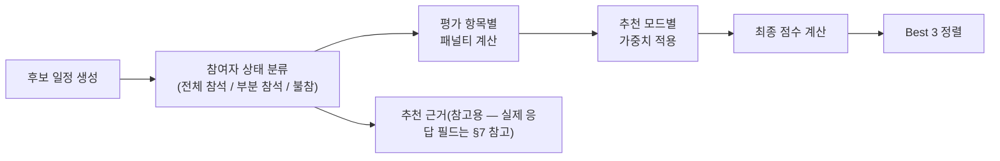

# 추천 스코어링 원본 자료 (기획자 확정본)

> 용도: [`trip-recommendation-algorithm.md`](trip-recommendation-algorithm.md)(`#50`)가 구현하는 패널티 구간표·모드별 가중치·동점 기준의 **원본 출처**. 이 문서는 참고 자료이며, Must Have·완료 기준 등 스펙 본문은 `trip-recommendation-algorithm.md`가 SSOT다.
> 출처: 기획자 작성 알고리즘 확정본, 2026-07-30 확정 반영
> 상태: 확정 (기획자 승인)

## 1. 계산 흐름



```
최종점수 = 100 - Σ(패널티 × 가중치)
```

## 2. 후보 일정 생성

사용자가 입력한 여행 기간(`trip.startRange`~`endRange`), 여행 일수(`trip.durationDays`)를 바탕으로 가능한 후보 일정을 슬라이딩 생성한다.

> 예시) 여행 기간: 8/1~8/31, 여행 일수: 2박 3일 → 8/1~8/3, 8/2~8/4, 8/3~8/5 … 형태로 생성

## 3. 참여자 상태 분류

후보 일정별로 각 참여자의 참석 상태와 불확실 정보를 분석한다.

**참석 상태**

| 상태 | 정의 |
| --- | --- |
| 전체 참석 | 여행 일정 전체 참석 가능 |
| 부분 참석 | 일정의 절반 이상을 하나의 연속된 구간으로 참석 가능(늦참 또는 조기 귀가) |
| 불참 | 전체 참석·부분 참석 조건을 모두 만족하지 못하는 경우 |

**불확실 정보** — 후보 일정 내 불확실 일정 여부를 확인해 불확실 인원·불확실 일정 수 계산에 활용한다.

### 3-1. 부분 참석 판정 기준

1. 후보 일정의 전체 일정 수 = **여행 일수 × 3** (하루 = 오전/오후/저녁)
2. 부분 참석 인정 최소 연속 참석 수 = 전체 일정 수의 **50% 이상**, 소수점 발생 시 **올림**

| 여행 기간 | 전체 일정 수 | 부분 참석 인정 기준 |
| --- | --- | --- |
| 1박 2일 | 6 | 3개 이상 연속 참석 |
| 2박 3일 | 9 | 5개 이상 연속 참석 |
| 3박 4일 | 12 | 6개 이상 연속 참석 |
| 4박 5일 | 15 | 8개 이상 연속 참석 |

**예시 (2박 3일, 10일~12일)** — 전체 일정 수 = 3일 × 3 = 9개, 부분 참석 인정 기준 = ⌈9 × 0.5⌉ = 5개 이상 연속 참석

| 참여자 | 불가능 일정 | 가능한 연속 일정 | 연속 참석 수 | 분류 |
| --- | --- | --- | --- | --- |
| A | 10일 오전, 12일 오후 | 10일 오후·저녁, 11일 오전·오후·저녁, 12일 오전 | 6개 | **부분 참석** |
| B | 10일 오후, 12일 오전 | 10일 저녁, 11일 오전·오후·저녁 | 4개 | **불참** |

연속 참석 구간은 **늦참(앞부분 결손) 또는 조기귀가(뒷부분 결손)** 형태만 인정한다 — 중간에 이탈했다가 다시 합류하는 형태(가운데 결손)는 불인정(불참으로 분류).

## 4. 불확실 판정

**불확실 인원** — 후보 일정 내 하나 이상의 일정 구간을 '불확실'로 응답한 참여자 수. 한 참여자가 여러 개의 불확실 일정을 등록해도 **1명으로만 계산**.

## 5. 평가 항목 정의 (원시 값 6종)

패널티 계산에 쓰이는 원시 평가 항목은 다음 6개다: 불참, 부분 참석, 불확실 인원, 불확실 일정, 연차 필요 인원, 총 연차 일수. 이 중 **비율/평균으로 변환한 4개**가 실제 패널티 대상이다(§6).

## 6. 평가 항목별 패널티 구간표

### 6-1. 불참률 (= 불참 인원 / 응답 참여자 수)

| 불참률 | 페널티 |
| --- | --- |
| 0% | 0 |
| 15% 이하 | 20 |
| 15% 초과 30% 미만 | 50 |
| 30% 이상 | 100 |

**구간 설정 기준 참고** — 주요 여행 인원인 3~8인에서는 불참자 1명만 발생해도 불참률이 크게 달라진다.

| 응답 참여자 수 | 1명 불참 | 2명 불참 | 3명 불참 |
| --- | --- | --- | --- |
| 3명 | 33.3% | 66.7% | 100% |
| 4명 | 25% | 50% | 75% |
| 5명 | 20% | 40% | 60% |
| 6명 | 16.7% | 33.3% | 50% |
| 7명 | 14.3% | 28.6% | 42.9% |
| 8명 | 12.5% | 25% | 37.5% |

- 15% 이하: 7~8인 중 1명 불참
- 15% 초과 30% 미만: 4~6인 중 1명 또는 7~8인 중 2명 불참
- 30% 이상: 소규모 여행에서 1명 또는 전체 인원의 상당수 불참

### 6-2. 부분 참석률 (= 부분 참석 인원 / 응답 참여자 수)

| 부분 참석 비율 | 페널티 |
| --- | --- |
| 0% | 0 |
| 15% 이하 | 5 |
| 15% 초과 30% 미만 | 10 |
| 30% 이상 | 20 |

### 6-3. 불확실 인원 비율 (= 불확실 인원 / 응답 참여자 수)

| 불확실 인원 비율 | 페널티 |
| --- | --- |
| 0% | 0 |
| 15% 이하 | 10 |
| 15% 초과 30% 미만 | 20 |
| 30% 이상 | 40 |

### 6-4. 1인당 평균 연차 일수 (= 총 연차 일수 / 연차 계산 대상 참여자 수)

| 1인당 평균 연차 일수 | 페널티 |
| --- | --- |
| 0일 | 0 |
| 0.5일 이하 | 1 |
| 0.5일 초과 1일 이하 | 3 |
| 1일 초과 2일 이하 | 5 |
| 2일 초과 | 1인당 평균 연차일수 × 5 |

## 7. 추천 모드별 가중치

사용자가 중요하게 생각하는 기준에 따라 각 평가 항목의 가중치를 조정해 반영한다.

| 추천 모드 | 불참률 | 부분 참석 인원 비율 | 불확실 인원 비율 | 1인당 평균 연차 일수 |
| --- | --- | --- | --- | --- |
| 기본 선택 | 1.0 | 1.0 | 1.0 | 1.0 |
| 모두 참석 | 5.0 | 3.0 | 1.0 | 0.5 |
| 휴가 아끼기 | 1.0 | 0.5 | 1.0 | 5.0 |
| 확실하게 가기 | 1.0 | 1.0 | 5.0 | 1.0 |

- **기본 선택** — 모든 평가 항목을 동일한 수준으로 고려, 특정 조건에 치우치지 않은 균형 추천
- **모두 참석** — 불참률 최우선, 부분 참석 인원 비율 추가 고려, 연차 부담은 상대적으로 낮게 반영. 가능한 한 많은 참여자가 여행 전체에 참석할 수 있는 일정 우선
- **휴가 아끼기** — 1인당 평균 연차 일수 최우선, 연차 절감 위해 부분 참석은 상대적으로 허용, 불참률·불확실 인원 비율은 기본 수준
- **확실하게 가기** — 불확실 인원 비율 최우선, 나머지는 기본 수준. 응답이 명확하고 실제 확정 가능성이 높은 일정 우선

## 8. 특수 규칙

### 8-1. 미응답 참여자

미응답 참여자는 추천 결과 계산 대상에서 **완전히 제외**한다 — 응답 참여자 수·불참률·부분 참석 인원 비율·불확실 인원 비율·연차 계산 전부에서 제외.

### 8-2. 완전 불참자

완전 불참자는 **연차 계산 대상에서만** 제외한다(총 연차 일수·연차 계산 대상 참여자 수) — 여행에 참여하지 않으므로 연차 부담을 고려하지 않는다. 응답 참여자 수·불참률 계산에는 포함된다.

### 8-3. 부분 참석과 불확실은 독립

동일한 참여자가 부분 참석 조건과 불확실 조건을 모두 만족하는 경우 **각 평가 항목에 모두 포함**한다 — 중복 계산 가능.

### 8-4. 불확실 일정 처리

불확실은 **날짜 단위**로 선택한다. 후보 일정에 포함된 날짜 중 하루 이상을 불확실로 선택한 경우 해당 참여자를 불확실 인원으로 계산한다. 동일 참여자가 여러 날짜를 불확실로 선택해도 **불확실 인원은 1명으로 계산**한다. 불확실 **일정 수**(선택한 날짜 개수의 합)는 동점 발생 시 우선순위 판단 기준으로만 활용한다(§8-6).

### 8-5. 반차 계산

반차는 0.5일로 계산한다 — 오전 반차 0.5일, 오후 반차 0.5일, 종일 연차 1일.

### 8-6. 동점 처리

최종 점수가 동일한 후보 일정은 아래 순서로 우선순위를 결정한다.

1. 불확실 일정 수가 적은 일정
2. 날짜가 빠른 일정
